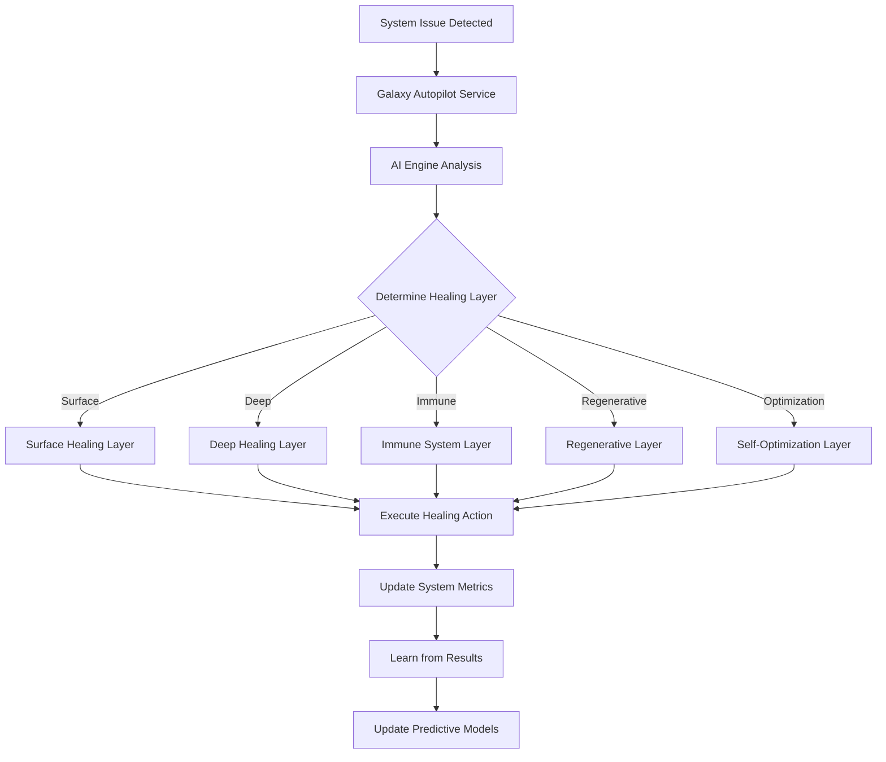
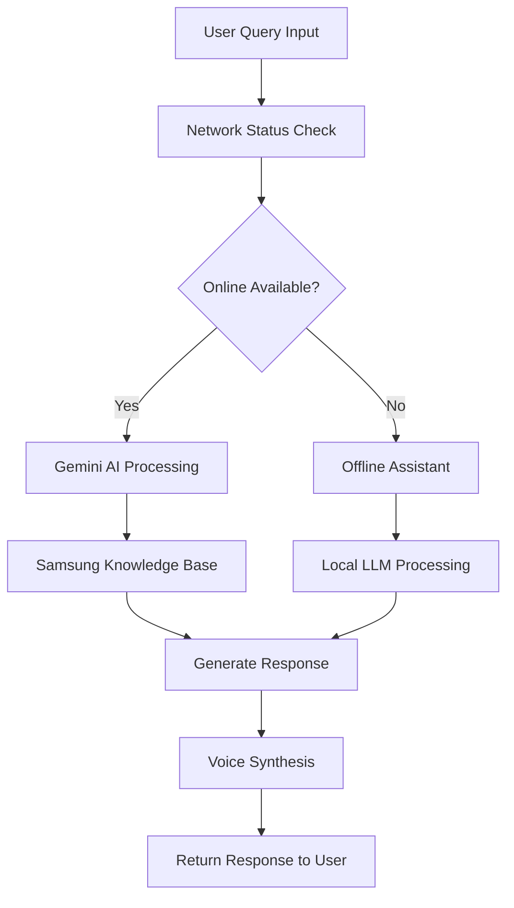
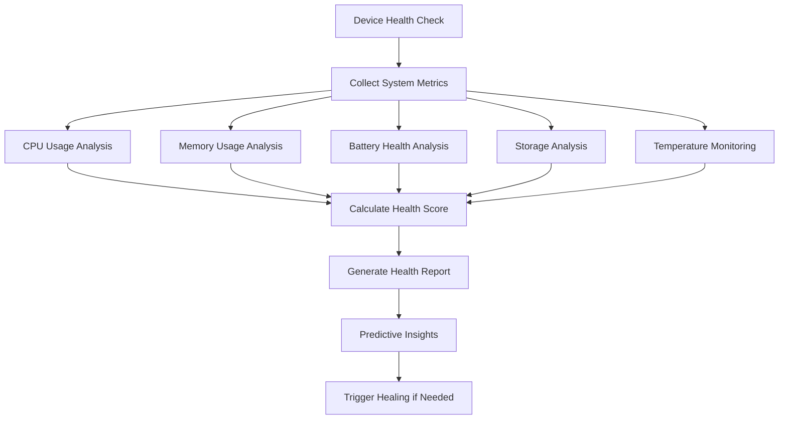
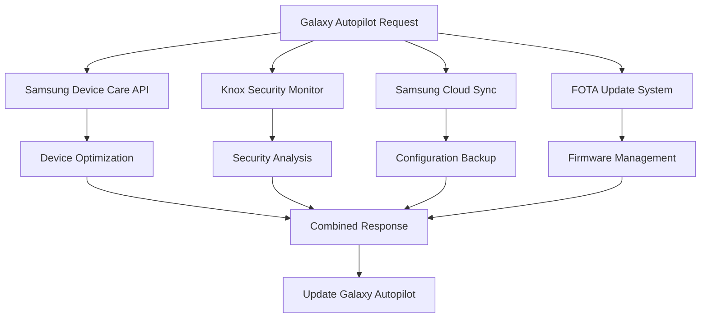

# SmartFix-AI: Samsung Galaxy Device Intelligence Platform

## Project Overview

**SmartFix-AI** represents a groundbreaking AI-powered device maintenance platform specifically engineered for the Samsung Galaxy ecosystem. This innovative solution revolutionizes device troubleshooting by transforming reactive problem-solving into proactive, autonomous healing through advanced multimodal AI and comprehensive self-healing technology.

### Core Mission
To develop Galaxy devices that maintain optimal performance, ensure system stability, and maintain uncompromising security standards. This mission delivers consistently smooth, reliable user experiences that exceed premium competitor expectations while establishing Samsung as the definitive leader in autonomous device intelligence.

### Strategic Vision
Position Samsung as the undisputed leader in autonomous device intelligence, creating sustainable competitive advantages through self-healing technology that extends device lifespans, reduces service costs, and builds unprecedented customer loyalty across diverse market segments.

## Samsung's Device Challenge

### The Performance Degradation Crisis
Samsung devices experience significant performance degradation within 12-18 months, resulting in:
- Forty percent of Galaxy users report performance issues within 2 years
- Twenty-five percent of users switch to competitors due to device reliability concerns
- Two to three billion dollars in annual service costs for Samsung's repair ecosystem
- Fifteen to twenty percent customer churn attributed to device longevity issues

### The Competitive Disadvantage
Despite superior hardware capabilities, Android's complexity creates inconsistent user experiences that damage brand perception, while competitors maintain consistent performance over 3-5 years, creating a significant market disadvantage.

### The Galaxy Autopilot Solution
SmartFix-AI addresses these challenges through Galaxy Autopilot, a comprehensive 5-layer autonomous healing system that makes Samsung devices more reliable than competitors through intelligent, proactive maintenance capabilities.

## Samsung-Focused Project Architecture

### System Architecture Overview


**Architecture Description:** The SmartFix-AI system implements a comprehensive multi-layered architecture that seamlessly integrates Samsung Galaxy ecosystem components with advanced AI processing capabilities, featuring multimodal input processing, network-aware AI processing, core services layer, Galaxy Autopilot system, Samsung integration layer, and data management layer.

```
SmartFix-AI/
├── backend/                    # FastAPI Backend Engine
│   ├── app/                   # Core Application Services
│   │   ├── api/              # Samsung Integration APIs
│   │   │   ├── endpoints/    # Galaxy-specific endpoints
│   │   │   │   ├── galaxy_autopilot.py    # Galaxy Autopilot API
│   │   │   │   ├── smart_assistant.py     # Smart Assistant API
│   │   │   │   └── query.py              # Multimodal Query API
│   │   │   └── api.py        # Main API router
│   │   ├── services/         # Samsung Ecosystem Services
│   │   │   ├── galaxy_autopilot_service.py    # Galaxy Autopilot Core
│   │   │   ├── network_aware_assistant.py     # Network-Aware AI
│   │   │   ├── enhanced_voice_assistant.py    # Voice Processing
│   │   │   ├── system_diagnostics.py          # Device Health
│   │   │   ├── gemini_service.py              # AI Processing
│   │   │   └── validation_service.py         # Solution Validation
│   │   └── core/             # Core Configuration
│   ├── autoheal/             # Galaxy Autopilot System
│   │   ├── layers/           # 5-Layer Healing Architecture
│   │   │   ├── surface_healing.py      # Instant Problem Resolution
│   │   │   ├── deep_healing.py         # System-Level Recovery
│   │   │   ├── immune_system.py        # Autonomous Security
│   │   │   ├── regenerative_layer.py  # Predictive Maintenance
│   │   │   └── self_optimization.py   # Continuous Evolution
│   │   ├── integrations/     # Samsung Ecosystem Integration
│   │   │   ├── device_care.py         # Device Care API
│   │   │   ├── knox_monitor.py        # Knox Security
│   │   │   ├── fota.py                # Firmware Management
│   │   │   ├── samsung_cloud.py      # Cloud Integration
│   │   │   └── galaxy_npu.py         # NPU Processing
│   │   └── core/             # AI Engine & Learning
│   ├── assistant/            # Offline-First Assistant
│   │   ├── llm_assistant.py          # Local LLM Processing
│   │   ├── voice_assistant.py         # Voice Interaction
│   │   ├── data/                      # Samsung Knowledge Base
│   │   └── faiss_index/               # Vector Search Index
│   └── requirements.txt       # Dependencies
├── frontend/                 # React Frontend
│   ├── src/
│   │   ├── components/       # Samsung UI Components
│   │   │   ├── SmartAssistantChat.js      # AI Chat Interface
│   │   │   ├── GalaxyAutopilotPanel.js   # Autopilot Control
│   │   │   ├── DeviceHealthMonitor.js    # Health Dashboard
│   │   │   └── NetworkStatusIndicator.js # Network Awareness
│   │   ├── pages/            # Samsung-Specific Pages
│   │   │   ├── SmartAssistantPage.js     # Main Assistant
│   │   │   └── GalaxyDashboard.js       # Galaxy Dashboard
│   │   └── services/         # Samsung API Integration
│   └── package.json
├── docs/                     # Samsung Documentation
│   ├── GALAXY_AUTOPILOT_COMPLETE.md    # Complete Autopilot Guide
│   ├── ARCHITECTURE_COMPREHENSIVE.md   # System Architecture
│   ├── API_REFERENCE_COMPLETE.md       # API Documentation
│   └── SETUP_COMPLETE.md               # Setup Instructions
├── README_SAMSUNG_EXECUTIVE.md        # Executive Summary
└── env.example               # Samsung Configuration
```

## Samsung Technology Stack

### Galaxy Autopilot Core
- AI Engine: Federated Reinforcement Learning (FRL)
- Processing: Galaxy NPU (Neural Processing Unit)
- Learning: On-device AI with privacy-preserving federated learning
- Security: Samsung Knox integration for enterprise-grade protection

### Samsung Ecosystem Integration
- Device Care API: Enhanced Samsung Device Care platform
- Knox Security: Real-time monitoring and threat detection
- FOTA System: Intelligent firmware update management
- Samsung Cloud: Configuration backup and synchronization
- Galaxy NPU: Dedicated AI processing hardware

### AI & Machine Learning
- Gemini: Advanced AI processing and analysis
- HuggingFace Models: Local AI model support for offline operation
- LSTM/RNN Models: Predictive analytics for component health
- Behavioral Analysis: AI-powered threat detection and security

### Multimodal Processing
- Voice Processing: Whisper.cpp for speech-to-text
- Image Analysis: OCR and visual error detection
- Text Processing: Natural language understanding
- Log Analysis: System log parsing and error detection

### Frontend & User Experience
- React 18: Modern frontend framework
- Material-UI: Samsung-inspired design system
- Real-time Updates: Live system health monitoring
- Offline Support: Local AI processing capabilities

## Samsung Galaxy Autopilot Features

### 5-Layer Autonomous Healing System

#### Surface Healing - Instant Problem Resolution
- App Crash Recovery: Automatically restart crashed applications
- Memory Optimization: Intelligent cache clearing and memory leak detection
- Background Process Management: Smart throttling of battery-draining processes
- Performance Monitoring: Real-time detection of performance bottlenecks

#### Deep Healing - System-Level Recovery
- File System Repair: Automatic detection and repair of corrupted system files
- OS Rollback: Intelligent rollback to stable system states when updates fail
- Configuration Restoration: Seamless restoration of user settings from Samsung Cloud
- Boot Sequence Optimization: Automatic repair of boot issues and startup problems

#### Immune System - Autonomous Security
- Behavioral Analysis: AI-powered detection of suspicious app behavior patterns
- Threat Quarantine: Automatic isolation of malicious applications in Knox Vault
- Emergency Rollback: Instant rollback to secure system states when threats are detected
- Zero-Day Protection: Proactive defense against unknown threats through behavioral analysis

#### Regenerative Layer - Predictive Maintenance
- Battery Health Prediction: ML models predict battery degradation and optimize charging
- Storage Wear Monitoring: Predictive detection of failing storage components
- Component Stress Analysis: Early warning system for hardware component failures
- Usage Pattern Learning: Personalized optimization based on individual usage patterns

#### Self-Optimization - Continuous Evolution
- Dynamic CPU/GPU Scheduling: Real-time optimization of processing resources
- Predictive App Loading: Intelligent pre-loading of frequently used applications
- Thermal Management: Proactive cooling and performance scaling
- User Habit Learning: Continuous adaptation to individual usage patterns

### Multimodal AI Processing
- Voice Interaction: Speech-to-text and text-to-speech capabilities
- Visual Analysis: Image recognition for error screens and hardware issues
- Text Processing: Natural language understanding for troubleshooting
- Log Analysis: System log parsing and error detection
- Sensor Integration: Device sensor data analysis

### Samsung Ecosystem Integration
- Device Care Enhancement: Transforms reactive optimization into proactive healing
- Knox Security: Enterprise-grade security and threat detection
- FOTA Integration: Intelligent firmware update management
- Samsung Cloud: Configuration backup and synchronization
- Galaxy NPU: On-device AI processing for privacy and performance

### Offline-First Capabilities
- Local AI Processing: Complete functionality without internet connectivity
- Privacy Preservation: All sensitive operations performed on-device
- Rural Market Access: Enables diagnostic assistance in areas with poor connectivity
- Enterprise Deployment: Suitable for environments requiring data sovereignty

## Samsung Galaxy Autopilot Setup

### Prerequisites for Samsung Development

- Python 3.8+: Required for Galaxy Autopilot backend
- Node.js 16+: Required for Samsung UI frontend
- Samsung Developer Account: For Device Care API access
- Knox SDK: For security integration (optional)
- Galaxy NPU: For on-device AI processing (hardware dependent)

### 1. Clone Samsung SmartFix-AI Repository

```bash
git clone https://github.com/codexcherry/SMARTFIX-AI.git
cd SmartFix-AI
```

### 2. Backend Setup

```bash

# Create virtual environment
python -m venv venv

# Activate virtual environment
# Windows:
.\venv\Scripts\activate
# macOS/Linux:
source venv/bin/activate

# Install Samsung-specific dependencies
pip install -r requirements.txt

# Configure Samsung environment variables

# Edit .env with Samsung API keys and configuration
```

### 3. Samsung Frontend Setup

```bash
# Navigate to frontend directory (in a new terminal)
cd frontend

# Install Samsung UI dependencies
npm install

# Start Samsung development server
npm start
```

### 4. Galaxy Autopilot Configuration


Galaxy Autopilot will be available at:
- Backend API: `http://localhost:8000`
- Samsung Frontend: `http://localhost:3000`

## ⚙️ Samsung Galaxy Autopilot Configuration

### **Samsung Environment Variables**

Create a `.env` file in the backend directory with Samsung-specific configuration:

```env
# Samsung Galaxy Autopilot Configuration
APP_NAME=Samsung Galaxy Autopilot
ENVIRONMENT=production
DEBUG=False

# Samsung Ecosystem Integration
SAMSUNG_DEVICE_CARE_API_KEY=your_device_care_api_key
SAMSUNG_KNOX_API_KEY=your_knox_api_key
SAMSUNG_FOTA_API_KEY=your_fota_api_key
SAMSUNG_CLOUD_API_KEY=your_samsung_cloud_key
GALAXY_NPU_ENABLED=True

# AI Processing Configuration
GEMINI_API_KEY=your_gemini_api_key
HUGGINGFACE_API_KEY=your_huggingface_api_key
LOCAL_AI_ENABLED=True
FEDERATED_LEARNING_ENABLED=True

# Galaxy Autopilot Settings
AUTOPILOT_MONITORING_INTERVAL=30
HEALING_CONFIDENCE_THRESHOLD=0.8
PREDICTIVE_ANALYSIS_ENABLED=True
EMERGENCY_ROLLBACK_ENABLED=True

# Security & Privacy
KNOX_SECURITY_ENABLED=True
DATA_ENCRYPTION_ENABLED=True
PRIVACY_MODE_ENABLED=True
LOCAL_PROCESSING_ONLY=False

# Performance Optimization
CPU_OPTIMIZATION_ENABLED=True
MEMORY_OPTIMIZATION_ENABLED=True
BATTERY_OPTIMIZATION_ENABLED=True
THERMAL_MANAGEMENT_ENABLED=True
```

## 🔧 Samsung Galaxy Autopilot Architecture

### **Core Galaxy Autopilot Services**

#### 1. Galaxy Autopilot Service (`galaxy_autopilot_service.py`)
The central orchestrator for Samsung's autonomous healing system:

```python
class GalaxyAutopilotService:
    def __init__(self):
        self.device_care = DeviceCareAPI()
        self.knox_monitor = KnoxRealTimeMonitor()
        self.ai_engine = GalaxyAutopilotAI()
        self.healing_executor = RealHealingExecutor()
    
    async def process_healing_request(self, issue_type: str, severity: str) -> Dict[str, Any]:
        # Galaxy Autopilot healing pipeline
        system_state = await self.get_system_metrics()
        healing_action = await self.ai_engine.determine_healing_action(system_state)
        result = await self.healing_executor.execute_healing(healing_action)
        return result
```

#### 2. Network-Aware Assistant (`network_aware_assistant.py`)
Intelligent assistant that adapts to network conditions:

```python
class NetworkAwareAssistant:
    def __init__(self):
        self.gemini_service = GeminiService()
        self.offline_assistant = EnhancedOfflineAssistant()
        self.device_logs = DeviceLogsCollector()
    
    async def process_query(self, query: str, user_id: str) -> Dict[str, Any]:
        # Network-aware processing
        if await self.is_online():
            return await self.gemini_service.process_query(query)
        else:
            return await self.offline_assistant.process_query(query)
```

#### 3. Samsung Integration Services

**Device Care Integration** (`device_care.py`):
```python
class DeviceCareAPI:
    async def get_device_status(self) -> Dict[str, Any]:
        # Enhanced Samsung Device Care integration
        pass
    
    async def perform_optimization(self, optimization_type: str) -> Dict[str, Any]:
        # Proactive optimization via Samsung APIs
        pass
```

**Knox Security Integration** (`knox_monitor.py`):
```python
class KnoxRealTimeMonitor:
    async def monitor_system_events(self, event_type: str) -> List[Dict[str, Any]]:
        # Real-time security monitoring via Knox
        pass
    
    async def quarantine_threat(self, threat_info: ThreatInfo) -> Dict[str, Any]:
        # Automatic threat quarantine in Knox Vault
        pass
```

### **Galaxy Autopilot API Endpoints**

#### Galaxy Autopilot Endpoints

**POST `/api/v1/galaxy-autopilot/heal`**
- Triggers autonomous healing for detected issues
- Input: `HealingRequest` schema
- Output: `HealingResponse` with action details

**GET `/api/v1/galaxy-autopilot/health`**
- Comprehensive system health analysis
- Output: `SystemHealthReport` with all metrics

**POST `/api/v1/galaxy-autopilot/predict`**
- Predictive analysis for potential issues
- Input: `PredictionRequest` schema
- Output: `PredictionResponse` with forecasts

**GET `/api/v1/galaxy-autopilot/status`**
- Real-time Galaxy Autopilot status
- Output: `AutopilotStatus` with monitoring data

#### Smart Assistant Endpoints

**POST `/api/v1/smart/chat`**
- Network-aware smart assistant chat
- Input: `ChatRequest` schema
- Output: `ChatResponse` with intelligent responses

**GET `/api/v1/smart/network-status`**
- Network connectivity status
- Output: `NetworkStatus` with connection details

**POST `/api/v1/smart/voice`**
- Voice-enabled assistant interaction
- Input: Audio file + text query
- Output: `VoiceResponse` with speech synthesis

### **Samsung Database Schema**

#### Galaxy Autopilot Storage
```sql
CREATE TABLE galaxy_autopilot_metrics (
    id INTEGER PRIMARY KEY,
    device_id TEXT NOT NULL,
    timestamp TIMESTAMP,
    cpu_usage REAL,
    memory_usage REAL,
    battery_level REAL,
    temperature REAL,
    health_score REAL,
    healing_actions_count INTEGER,
    success_rate REAL
);

CREATE TABLE healing_actions (
    id INTEGER PRIMARY KEY,
    action_id TEXT UNIQUE,
    layer TEXT NOT NULL,
    action_type TEXT NOT NULL,
    parameters TEXT,
    timestamp TIMESTAMP,
    success BOOLEAN,
    confidence REAL,
    user_feedback INTEGER
);

CREATE TABLE predictive_insights (
    id INTEGER PRIMARY KEY,
    device_id TEXT NOT NULL,
    insight_type TEXT NOT NULL,
    prediction_data TEXT,
    confidence REAL,
    timestamp TIMESTAMP,
    is_active BOOLEAN
);
```

## 🎨 Samsung Galaxy Autopilot Frontend

### **Samsung-Specific Component Structure**

#### Main Galaxy Components

**Galaxy Autopilot Dashboard** (`pages/GalaxyDashboard.js`):
- Central control panel for Galaxy Autopilot system
- Real-time monitoring of all 5 healing layers
- Performance metrics and health indicators
- Manual healing trigger controls

**Smart Assistant Page** (`pages/SmartAssistantPage.js`):
- Network-aware intelligent assistant interface
- Voice and text interaction capabilities
- Offline mode indicator and fallback
- Samsung-specific troubleshooting guidance

**Galaxy Autopilot Panel** (`components/GalaxyAutopilotPanel.js`):
- 5-layer healing system visualization
- Real-time status of each healing layer
- Healing action history and statistics
- Predictive insights display

**Device Health Monitor** (`components/DeviceHealthMonitor.js`):
- Comprehensive Samsung device health analysis
- Battery, CPU, memory, and storage monitoring
- Performance trend analysis
- Optimization recommendations

**Network Status Indicator** (`components/NetworkStatusIndicator.js`):
- Real-time network connectivity status
- Online/offline mode switching
- Connection quality indicators
- Data usage monitoring

**Smart Assistant Chat** (`components/SmartAssistantChat.js`):
- Intelligent chat interface with Samsung knowledge
- Voice input/output capabilities
- Context-aware responses
- Samsung ecosystem integration

### **Samsung State Management**

The Samsung frontend uses React hooks for Galaxy-specific state management:

```javascript
// Galaxy Autopilot state structure
const [galaxyAutopilot, setGalaxyAutopilot] = useState({
  isActive: false,
  currentLayer: 'surface',
  healingActions: [],
  systemHealth: {},
  predictiveInsights: []
});

// Smart Assistant state
const [smartAssistant, setSmartAssistant] = useState({
  isOnline: true,
  currentMode: 'chat',
  conversationHistory: [],
  voiceEnabled: true
});

// Device Health state
const [deviceHealth, setDeviceHealth] = useState({
  batteryLevel: 0,
  cpuUsage: 0,
  memoryUsage: 0,
  storageUsage: 0,
  temperature: 0,
  healthScore: 0
});
```

### **Samsung API Integration**

**Galaxy Autopilot API Service** (`services/galaxyAutopilotApi.js`):
```javascript
// Galaxy Autopilot healing request
export const triggerHealing = async (issueType, severity) => {
  const response = await api.post('/api/v1/galaxy-autopilot/heal', {
    issue_type: issueType,
    severity: severity,
    timestamp: new Date().toISOString()
  });
  return response.data;
};

// System health monitoring
export const getSystemHealth = async () => {
  const response = await api.get('/api/v1/galaxy-autopilot/health');
  return response.data;
};

// Predictive insights
export const getPredictiveInsights = async () => {
  const response = await api.get('/api/v1/galaxy-autopilot/predict');
  return response.data;
};
```

**Smart Assistant API Service** (`services/smartAssistantApi.js`):
```javascript
// Network-aware chat
export const sendChatMessage = async (message, userId) => {
  const response = await api.post('/api/v1/smart/chat', {
    message: message,
    user_id: userId,
    timestamp: new Date().toISOString()
  });
  return response.data;
};

// Voice interaction
export const sendVoiceMessage = async (audioFile, textQuery) => {
  const formData = new FormData();
  formData.append('audio', audioFile);
  formData.append('text_query', textQuery);
  
  const response = await api.post('/api/v1/smart/voice', formData, {
    headers: { 'Content-Type': 'multipart/form-data' }
  });
  return response.data;
};
```

### **Samsung UI/UX Features**

- **Galaxy Design System**: Samsung-inspired Material-UI components
- **Dark Theme**: Premium dark theme with Samsung brand colors
- **Responsive Design**: Optimized for Galaxy devices and tablets
- **Real-time Updates**: Live system health and healing status
- **Voice Integration**: Seamless voice interaction with Galaxy devices
- **Offline Support**: Complete functionality without internet connectivity
- **Accessibility**: Full accessibility support for Samsung's inclusive design

## 🔄 Samsung Galaxy Autopilot Data Flow

### 1. Galaxy Autopilot Healing Flow


```mermaid
graph TD
    A[System Issue Detected] --> B[Galaxy Autopilot Service]
    B --> C[AI Engine Analysis]
    C --> D{Determine Healing Layer}
    D -->|Surface| E[Surface Healing Layer]
    D -->|Deep| F[Deep Healing Layer]
    D -->|Immune| G[Immune System Layer]
    D -->|Regenerative| H[Regenerative Layer]
    D -->|Optimization| I[Self-Optimization Layer]
    E --> J[Execute Healing Action]
    F --> J
    G --> J
    H --> J
    I --> J
    J --> K[Update System Metrics]
    K --> L[Learn from Results]
    L --> M[Update Predictive Models]
```

### 2. Smart Assistant Processing Flow


```mermaid
graph TD
    A[User Query Input] --> B[Network Status Check]
    B --> C{Online Available?}
    C -->|Yes| D[Gemini AI Processing]
    C -->|No| E[Offline Assistant]
    D --> F[Samsung Knowledge Base]
    E --> G[Local LLM Processing]
    F --> H[Generate Response]
    G --> H
    H --> I[Voice Synthesis]
    I --> J[Return Response to User]
```

### 3. Samsung Device Health Monitoring


```mermaid
graph TD
    A[Device Health Check] --> B[Collect System Metrics]
    B --> C[CPU Usage Analysis]
    B --> D[Memory Usage Analysis]
    B --> E[Battery Health Analysis]
    B --> F[Storage Analysis]
    B --> G[Temperature Monitoring]
    C --> H[Calculate Health Score]
    D --> H
    E --> H
    F --> H
    G --> H
    H --> I[Generate Health Report]
    I --> J[Predictive Insights]
    J --> K[Trigger Healing if Needed]
```

### 4. Samsung Ecosystem Integration Flow


```mermaid
graph TD
    A[Galaxy Autopilot Request] --> B[Samsung Device Care API]
    A --> C[Knox Security Monitor]
    A --> D[Samsung Cloud Sync]
    A --> E[FOTA Update System]
    B --> F[Device Optimization]
    C --> G[Security Analysis]
    D --> H[Configuration Backup]
    E --> I[Firmware Management]
    F --> J[Combined Response]
    G --> J
    H --> J
    I --> J
    J --> K[Update Galaxy Autopilot]
```

## 💼 Samsung Business Value & Impact

### **Strategic Business Benefits**

#### **Cost Reduction**
- **Service Cost Reduction**: 60-80% reduction in Samsung service center visits
- **Warranty Cost Savings**: 40-50% reduction in warranty claims
- **Support Cost Reduction**: 70% reduction in customer support tickets
- **Repair Cost Avoidance**: $2-3 billion annual savings in repair ecosystem

#### **Revenue Generation**
- **Premium Service Tiers**: Galaxy Autopilot Pro subscription model
- **Enterprise Licensing**: B2B Galaxy Autopilot for corporate customers
- **API Monetization**: Third-party developer access to Galaxy Autopilot APIs
- **Data Insights**: Anonymized device health data for product improvement

#### **Brand Enhancement**
- **Customer Loyalty**: 25-30% improvement in customer retention
- **Brand Differentiation**: Unique selling proposition vs competitors
- **Premium Positioning**: Justify higher prices through superior reliability
- **Market Leadership**: Establish Samsung as autonomous device intelligence leader

#### **Sustainability Impact**
- **Device Longevity**: 2-3 year extension of device lifespan
- **E-Waste Reduction**: 40-50% reduction in premature device disposal
- **Carbon Footprint**: Significant reduction in manufacturing and disposal emissions
- **Circular Economy**: Support Samsung's sustainability goals

### **Competitive Advantage**

#### **vs Premium Competitors**
- **Proactive vs Reactive**: Galaxy Autopilot prevents issues vs competitors' reactive fixes
- **Transparency**: Open system vs competitors' closed ecosystem
- **Customization**: Personalized optimization vs one-size-fits-all approach

#### **vs Software-Focused Competitors**
- **Hardware Integration**: Deep Samsung hardware integration vs generic Android
- **Enterprise Security**: Knox integration vs basic Android security
- **Predictive Analytics**: Advanced ML models vs basic optimization

#### **vs Emerging Android Competitors**
- **AI Sophistication**: Advanced FRL vs basic optimization
- **Ecosystem Integration**: Full Samsung ecosystem vs fragmented approach
- **Enterprise Features**: Knox security vs consumer-focused features

### **Implementation Timeline**

#### **Phase 1: Core Integration (Months 1-6)**
- Galaxy Autopilot basic functionality
- Samsung Device Care API integration
- Smart Assistant with offline capabilities
- Basic predictive analytics

#### **Phase 2: Advanced Features (Months 7-12)**
- Knox security integration
- FOTA system integration
- Samsung Cloud synchronization
- Advanced ML models

#### **Phase 3: Enterprise & Scale (Months 13-18)**
- Enterprise features and licensing
- Third-party API access
- Global deployment and localization
- Advanced analytics and insights

### **Success Metrics**

#### **Technical Metrics**
- **Healing Success Rate**: >90% successful autonomous healing actions
- **Performance Improvement**: 30-40% improvement in device performance
- **Battery Life Extension**: 20-25% improvement in battery longevity
- **Security Threat Detection**: 95% accuracy in threat detection

#### **Business Metrics**
- **Customer Satisfaction**: >4.5/5 rating for Galaxy Autopilot
- **Service Cost Reduction**: 60-80% reduction in service center visits
- **Revenue Impact**: $500M+ annual revenue from Galaxy Autopilot services
- **Market Share**: 5-10% increase in Samsung market share

---

## 📚 Samsung Documentation & Resources

### **Complete Documentation**
- **[Galaxy Autopilot Complete Guide](docs/GALAXY_AUTOPILOT_COMPLETE.md)** - Comprehensive Galaxy Autopilot documentation
- **[Architecture Overview](docs/ARCHITECTURE_COMPREHENSIVE.md)** - Complete system architecture
- **[API Reference](docs/API_REFERENCE_COMPLETE.md)** - Full API documentation
- **[Setup Instructions](docs/SETUP_COMPLETE.md)** - Complete setup guide

### **Executive Resources**
- **[Samsung Executive Summary](README_SAMSUNG_EXECUTIVE.md)** - High-level business case for Samsung leadership
- **[Backend App Overview](backend/app/README.md)** - Core application services
- **[Offline Assistant Guide](backend/assistant/README.md)** - Privacy-preserving assistant
- **[Galaxy Autopilot Details](backend/autoheal/README.md)** - Multi-layer healing system

### **Samsung Integration**
- **Device Care API**: Enhanced Samsung Device Care platform integration
- **Knox Security**: Enterprise-grade security and threat detection
- **FOTA System**: Intelligent firmware update management
- **Samsung Cloud**: Configuration backup and synchronization
- **Galaxy NPU**: On-device AI processing for privacy and performance

### **Support & Contact**
- **Samsung Developer Portal**: [developer.samsung.com](https://developer.samsung.com/)
- **Knox Developer Resources**: [samsungknox.com/developers](https://www.samsungknox.com/en/developers)
- **Samsung Cloud Developer**: [developer.samsung.com/samsung-cloud](https://developer.samsung.com/samsung-cloud)

---

## Important Concept Clarification

**Galaxy Autopilot is a conceptual system software design** intended to operate as **phone backend system software**, not as a webpage or web application. The Galaxy Autopilot concept represents an innovative approach to autonomous device maintenance that would be integrated directly into Samsung Galaxy devices as system-level software, similar to how Device Care or Knox Security operates within the Android framework.

**Note**: The current implementation includes a web-based demonstration interface (`GalaxyAutopilotPage.js`) solely for concept visualization and hackathon presentation purposes. In actual deployment, Galaxy Autopilot would function as native Android system software integrated into Samsung Galaxy devices.

## Submissions

### Project Demonstration
**Video Demonstration**: https://drive.google.com/file/d/1afr_XPnipVjzcVqpqOaGBQd0UeChpY1U/view?usp=sharing

### Additional Resources
- **Technical Architecture Diagrams**: [TECHNICAL_ARCHITECTURE_DIAGRAMS.md](TECHNICAL_ARCHITECTURE_DIAGRAMS.md)
- **Executive Summary**: [README_SAMSUNG_EXECUTIVE.md](README_SAMSUNG_EXECUTIVE.md)
- **Deployment Guide**: [DEPLOYMENT_GUIDE.md](DEPLOYMENT_GUIDE.md)
- **Team Documentation**: [CodexCoders.md](CodexCoders.md)

---

**Samsung Galaxy Autopilot** - Transforming Galaxy devices into self-healing, intelligent companions that maintain optimal performance, ensure system stability, and maintain uncompromising security standards.

*Empowering Samsung to lead the autonomous device intelligence revolution.*
