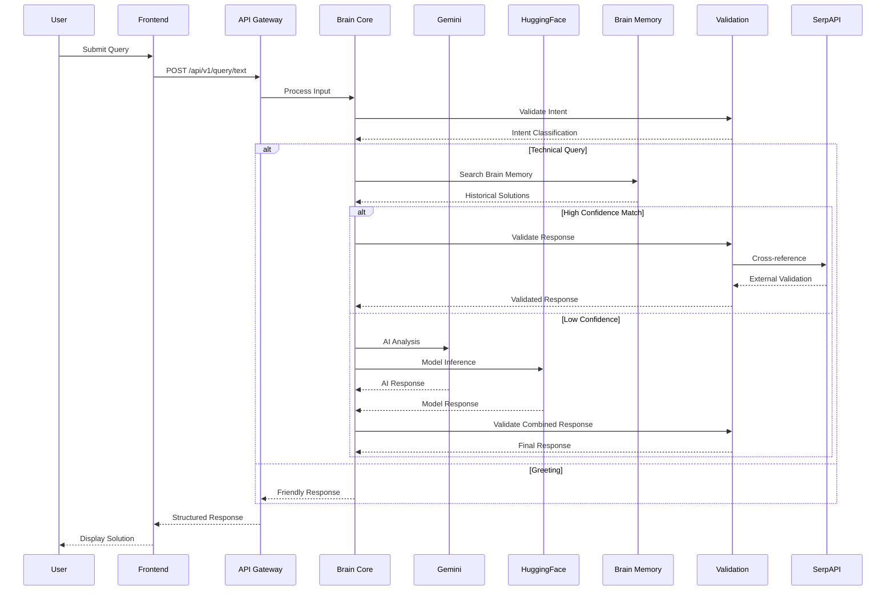
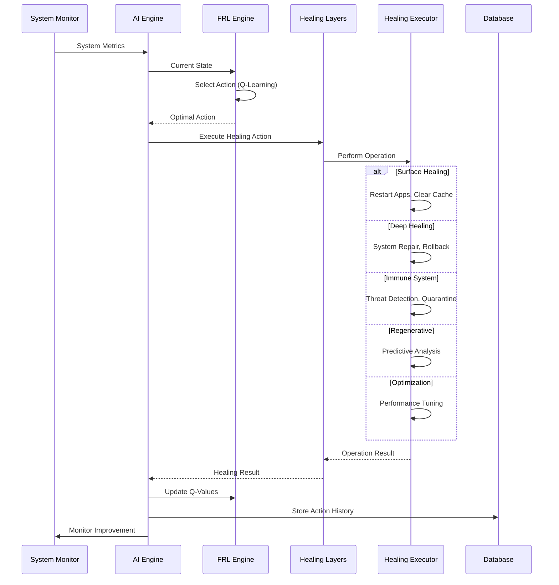

# SmartFix-AI: Comprehensive System Architecture

## 🏗️ System Overview

SmartFix-AI is a sophisticated, multi-layered AI-powered troubleshooting platform that combines advanced machine learning models with real-world system operations to provide intelligent solutions for technical issues. The system operates across multiple domains: traditional troubleshooting, autonomous system healing, and offline AI capabilities.

## 🎯 Core Architecture Principles

### 1. **Multi-Modal Intelligence**
- **Text Processing**: Natural language understanding for problem description
- **Image Analysis**: Computer vision for screenshot and error message analysis
- **Voice Processing**: Speech-to-text and voice command recognition
- **Log Analysis**: System and application log parsing and interpretation

### 2. **Hybrid AI Architecture**
- **Online AI Services**: Google Gemini, HuggingFace for cloud-based processing
- **Offline AI Models**: Local LLM, OCR, and speech processing capabilities
- **Brain Memory System**: Intelligent learning and pattern recognition
- **Federated Learning**: Privacy-preserving collaborative intelligence

### 3. **Autonomous System Healing**
- **Multi-Layer Healing**: Surface, Deep, Immune, Regenerative, and Optimization layers
- **Real System Operations**: Actual process management, memory optimization, and system repair
- **Predictive Analytics**: Proactive issue detection and prevention
- **Samsung Integration**: Native integration with Galaxy device ecosystem

## 🏛️ System Architecture Diagram

```mermaid
graph TB
    subgraph "Frontend Layer"
        A[React Dashboard] --> B[SmartFlix Interface]
        A --> C[Galaxy Autopilot UI]
        A --> D[Voice Assistant UI]
        A --> E[Device Analyzer UI]
    end
    
    subgraph "API Gateway Layer"
        F[FastAPI Router] --> G[Authentication]
        F --> H[Rate Limiting]
        F --> I[CORS Management]
    end
    
    subgraph "Core Services Layer"
        J[Brain Core Engine] --> K[Intent Validation]
        J --> L[Context Processing]
        J --> M[Solution Generation]
        
        N[Galaxy Autopilot AI] --> O[FRL Engine]
        N --> P[System Monitor]
        N --> Q[Healing Executor]
        
        R[Network Aware Assistant] --> S[Network Detection]
        R --> T[Offline Fallback]
        R --> U[Context Enhancement]
    end
    
    subgraph "AI Processing Layer"
        V[Gemini Service] --> W[Text Analysis]
        X[HuggingFace Service] --> Y[Model Inference]
        Z[Local LLM Service] --> AA[Offline Processing]
        BB[OCR Service] --> CC[Image Analysis]
        DD[Speech Service] --> EE[Voice Processing]
    end
    
    subgraph "Data Layer"
        FF[SQLite Database] --> GG[User Data]
        FF --> HH[Query History]
        FF --> II[Brain Memory]
        
        JJ[FAISS Vector DB] --> KK[Knowledge Base]
        JJ --> LL[Semantic Search]
        
        MM[System Monitoring] --> NN[Real-time Metrics]
        MM --> OO[Performance Data]
    end
    
    subgraph "External Services"
        PP[SerpAPI] --> QQ[Web Search]
        RR[Twilio] --> SS[Notifications]
        TT[Samsung APIs] --> UU[Device Integration]
    end
    
    A --> F
    F --> J
    F --> N
    F --> R
    J --> V
    J --> X
    J --> Z
    N --> MM
    R --> BB
    R --> DD
    J --> FF
    J --> JJ
    J --> PP
    J --> RR
    N --> TT
```



## 🔧 Component Architecture

### **Frontend Architecture**

#### **React Application Structure**
```
frontend/src/
├── components/           # Reusable UI components
│   ├── TextQueryForm.js     # Text input processing
│   ├── ImageQueryForm.js    # Image upload and analysis
│   ├── VoiceAssistant.js    # Voice command interface
│   ├── SolutionDisplay.js   # Solution presentation
│   ├── DeviceAnalyzer.js    # System diagnostics UI
│   └── SmartAssistantChat.js # AI conversation interface
├── pages/               # Main application pages
│   ├── SmartFlixDashboard.js  # Main dashboard
│   ├── GalaxyAutopilotPage.js  # Autopilot interface
│   ├── VoiceAssistantPage.js   # Voice assistant page
│   └── DeviceAnalyzerPage.js   # Device analysis page
├── services/           # API communication layer
│   ├── api.js              # Core API client
│   ├── smartAssistantApi.js # Smart assistant API
│   └── galaxyAutopilotApi.js # Galaxy Autopilot API
└── App.js             # Main application component
```

#### **Key Frontend Features**
- **Material-UI Design System**: Consistent, modern interface
- **Dark Theme**: Premium dark theme with gradient accents
- **Responsive Design**: Mobile-first responsive layout
- **Real-time Updates**: Live status monitoring and updates
- **Accessibility**: Full accessibility support with gesture control
- **Animation**: Smooth transitions with Framer Motion

### **Backend Architecture**

#### **Core Application Structure**
```
backend/app/
├── api/                # API endpoints and routing
│   ├── api.py             # Main API router
│   └── endpoints/         # Individual endpoint modules
│       ├── query.py           # Core query processing
│       ├── assistant.py       # AI assistant endpoints
│       ├── galaxy_autopilot.py # Galaxy Autopilot endpoints
│       ├── enhanced_voice.py  # Enhanced voice processing
│       └── smart_assistant.py # Smart assistant endpoints
├── core/               # Core system components
│   ├── config.py          # Configuration management
│   ├── security.py        # Authentication and security
│   ├── monitoring.py      # Health monitoring
│   └── retry.py           # Retry mechanisms
├── services/           # Business logic services
│   ├── brain_core.py      # Central AI processing engine
│   ├── brain_memory.py    # Learning and memory system
│   ├── gemini_service.py  # Google Gemini integration
│   ├── huggingface_service.py # HuggingFace integration
│   ├── network_aware_assistant.py # Network-aware processing
│   ├── validation_service.py # Response validation
│   └── device_logs_collector.py # System data collection
├── models/             # Data models and schemas
│   └── schemas.py         # Pydantic models
└── database/           # Database models
    └── models.py           # SQLAlchemy models
```

#### **Galaxy Autopilot Architecture**
```
backend/galaxy_autopilot/
├── core/               # Core AI engine and configuration
│   ├── ai_engine.py        # Federated Reinforcement Learning
│   ├── config.py           # Galaxy Autopilot configuration
│   ├── system_monitor.py   # Real system monitoring
│   ├── database.py         # Database management
│   └── healing_executor.py # Real healing operations
├── layers/             # Multi-layer healing system
│   ├── surface_healing.py  # Surface-level healing
│   ├── deep_healing.py     # Deep system healing
│   ├── immune_system.py    # Security and threat protection
│   ├── regenerative_layer.py # Predictive analytics
│   └── self_optimization.py # Performance optimization
├── integrations/       # Samsung service integrations
│   ├── device_care.py      # Samsung Device Care API
│   ├── knox_monitor.py     # Knox Real-Time Monitor
│   ├── fota.py             # Samsung FOTA
│   ├── samsung_cloud.py    # Samsung Cloud
│   └── galaxy_npu.py       # Galaxy NPU integration
└── api/               # API endpoints
    ├── endpoints.py        # Main API endpoints
    └── enhanced_endpoints.py # Enhanced API endpoints
```

#### **Offline Assistant Architecture**
```
backend/assistant/
├── llm_assistant.py       # Enhanced assistant with LLM
├── voice_assistant.py      # Voice-enabled assistant
├── api_integration.py      # FastAPI integration
├── build_index.py          # FAISS index creation
├── data/                   # Knowledge base
│   └── troubleshooting_solutions_1000plus.json
└── faiss_index/            # Vector database
    ├── embeddings.npy
    ├── meta.json
    └── troubleshoot.index
```

## 🔄 Data Flow Architecture

### **Query Processing Flow**



### **Galaxy Autopilot Healing Flow**



## 🧠 AI Architecture Deep Dive

### **Brain Core System**

The Brain Core serves as the central intelligence hub, orchestrating all AI services and decision-making processes.

#### **Core Components**
```python
class BrainCore:
    def __init__(self):
        self.brain_memory = BrainMemory()           # Learning system
        self.hf_service = HuggingFaceService()      # Local AI models
        self.gemini_service = GeminiService()       # Cloud AI service
        self.serp_service = SerpAPIService()        # Web search
        self.ocr_service = OCRService()             # Image analysis
        self.validation_service = ValidationService() # Response validation
        self.network_diagnostics = NetworkDiagnosticsService()
        self.system_diagnostics = SystemDiagnosticsService()
```

#### **Processing Pipeline**
1. **Input Validation**: Intent detection and context analysis
2. **Memory Search**: Query brain memory for similar problems
3. **AI Analysis**: Multi-model analysis with confidence scoring
4. **Response Validation**: Cross-reference with external sources
5. **Learning Update**: Store successful solutions for future use

### **Federated Reinforcement Learning**

The Galaxy Autopilot system implements a sophisticated FRL architecture for autonomous system healing.

#### **FRL Components**
```python
class FederatedReinforcementLearning:
    def __init__(self, device_id: str):
        self.q_table = {}                          # State-action values
        self.action_history = []                    # Action tracking
        self.reward_history = []                    # Reward tracking
        self.model_weights = {}                    # Model parameters
        self.learning_rate = 0.1                    # Learning rate
        self.discount_factor = 0.9                  # Future reward discount
        self.epsilon = 0.1                         # Exploration rate
```

#### **Learning Process**
1. **State Encoding**: Convert system metrics to discrete states
2. **Action Selection**: Epsilon-greedy policy for action selection
3. **Action Execution**: Perform healing operations on system
4. **Reward Calculation**: Measure immediate and long-term improvements
5. **Model Update**: Update Q-values using temporal difference learning
6. **Federated Learning**: Share anonymized model weights globally

### **Multi-Modal AI Processing**

#### **Text Processing Pipeline**
```python
async def process_text_query(self, query: str) -> Dict[str, Any]:
    # 1. Intent Classification
    intent = await self.validation_service.validate_query_intent(query)
    
    # 2. Context Enhancement
    context = await self._enhance_context(query)
    
    # 3. Multi-Model Analysis
    gemini_result = await self.gemini_service.analyze_text(query)
    hf_result = await self.hf_service.classify_text(query)
    
    # 4. Response Fusion
    combined_response = await self._fuse_responses(gemini_result, hf_result)
    
    # 5. Validation
    validated_response = await self.validation_service.validate_response(combined_response)
    
    return validated_response
```

#### **Image Processing Pipeline**
```python
async def process_image_query(self, image_data: bytes) -> Dict[str, Any]:
    # 1. OCR Text Extraction
    extracted_text = await self.ocr_service.process_image(image_data)
    
    # 2. Error Pattern Detection
    error_patterns = await self.ocr_service.detect_error_patterns(image_data)
    
    # 3. UI Element Analysis
    ui_elements = await self.ocr_service.extract_ui_elements(image_data)
    
    # 4. Combined Analysis
    analysis_result = await self._analyze_image_content(
        extracted_text, error_patterns, ui_elements
    )
    
    return analysis_result
```

## 🗄️ Data Architecture

### **Database Schema**

#### **Core Tables**
```sql
-- User Management
CREATE TABLE users (
    id TEXT PRIMARY KEY,
    email TEXT UNIQUE NOT NULL,
    username TEXT UNIQUE NOT NULL,
    password_hash TEXT NOT NULL,
    role TEXT DEFAULT 'user',
    created_at TIMESTAMP DEFAULT CURRENT_TIMESTAMP
);

-- Query History
CREATE TABLE queries (
    id TEXT PRIMARY KEY,
    user_id TEXT REFERENCES users(id),
    query_text TEXT NOT NULL,
    input_type TEXT NOT NULL,
    solution TEXT,
    confidence_score REAL,
    processing_time REAL,
    created_at TIMESTAMP DEFAULT CURRENT_TIMESTAMP
);

-- Brain Memory
CREATE TABLE brain_memory (
    id INTEGER PRIMARY KEY AUTOINCREMENT,
    problem_hash TEXT UNIQUE,
    problem_text TEXT NOT NULL,
    problem_type TEXT NOT NULL,
    device_category TEXT,
    solution_steps TEXT NOT NULL,
    confidence_score REAL DEFAULT 0.0,
    success_rate REAL DEFAULT 0.0,
    usage_count INTEGER DEFAULT 0,
    created_at TIMESTAMP DEFAULT CURRENT_TIMESTAMP
);

-- Galaxy Autopilot Metrics
CREATE TABLE system_metrics (
    id INTEGER PRIMARY KEY AUTOINCREMENT,
    device_id TEXT NOT NULL,
    cpu_usage REAL,
    memory_usage REAL,
    disk_usage REAL,
    temperature REAL,
    health_score REAL,
    timestamp TIMESTAMP DEFAULT CURRENT_TIMESTAMP
);

-- Healing Actions
CREATE TABLE healing_actions (
    id INTEGER PRIMARY KEY AUTOINCREMENT,
    device_id TEXT NOT NULL,
    action_type TEXT NOT NULL,
    layer TEXT NOT NULL,
    parameters TEXT,
    success BOOLEAN,
    improvement_score REAL,
    timestamp TIMESTAMP DEFAULT CURRENT_TIMESTAMP
);
```

### **Vector Database (FAISS)**

The system uses FAISS for semantic search and knowledge retrieval:

```python
# FAISS Index Structure
class KnowledgeBase:
    def __init__(self):
        self.index = faiss.IndexFlatIP(384)  # 384-dimensional embeddings
        self.embeddings = []                  # Vector embeddings
        self.metadata = []                    # Associated metadata
        self.solutions = []                   # Solution data
    
    async def search_similar(self, query: str, k: int = 5):
        # Generate query embedding
        query_embedding = await self._generate_embedding(query)
        
        # Search similar vectors
        scores, indices = self.index.search(query_embedding, k)
        
        # Return relevant solutions
        return [self.solutions[i] for i in indices[0]]
```

## 🔒 Security Architecture

### **Authentication & Authorization**

```python
class SecurityManager:
    def __init__(self):
        self.jwt_secret = settings.SECRET_KEY
        self.algorithm = settings.ALGORITHM
        self.token_expire_minutes = settings.ACCESS_TOKEN_EXPIRE_MINUTES
    
    async def create_access_token(self, user_data: dict) -> str:
        # JWT token creation with user claims
        pass
    
    async def verify_token(self, token: str) -> dict:
        # Token validation and user extraction
        pass
    
    async def check_permissions(self, user_role: str, resource: str) -> bool:
        # Role-based access control
        pass
```

### **Data Privacy & Protection**

1. **Local Processing**: All sensitive operations performed locally
2. **Data Anonymization**: Personal data anonymized before external sharing
3. **Federated Learning**: Only model weights shared, not personal data
4. **Encryption**: All data encrypted in transit and at rest
5. **Access Control**: Role-based permissions and API key management

## 📊 Monitoring & Observability

### **Health Monitoring System**

```python
class HealthMonitor:
    def __init__(self):
        self.metrics_collector = MetricsCollector()
        self.alert_manager = AlertManager()
        self.dashboard = MonitoringDashboard()
    
    async def collect_system_metrics(self):
        return {
            "cpu_usage": psutil.cpu_percent(),
            "memory_usage": psutil.virtual_memory().percent,
            "disk_usage": psutil.disk_usage('/').percent,
            "active_connections": len(psutil.net_connections()),
            "timestamp": datetime.now()
        }
    
    async def check_service_health(self):
        services = {
            "gemini": await self._check_gemini_service(),
            "huggingface": await self._check_hf_service(),
            "database": await self._check_database(),
            "galaxy_autopilot": await self._check_autopilot()
        }
        return services
```

### **Performance Metrics**

- **Response Time**: API endpoint response times
- **Throughput**: Requests per second
- **Error Rate**: Failed request percentage
- **Resource Usage**: CPU, memory, disk utilization
- **AI Model Performance**: Inference time and accuracy
- **Healing Effectiveness**: Success rate of healing actions

## 🚀 Deployment Architecture

### **Development Environment**
```yaml
# docker-compose.dev.yml
version: '3.8'
services:
  backend:
    build: ./backend
    ports:
      - "8000:8000"
    environment:
      - DEBUG=true
      - DATABASE_URL=sqlite:///./smartfix_ai.db
    volumes:
      - ./backend:/app
      - ./backend/offline_models:/app/offline_models
  
  frontend:
    build: ./frontend
    ports:
      - "3000:3000"
    volumes:
      - ./frontend:/app
      - /app/node_modules
```

### **Production Environment**
```yaml
# docker-compose.prod.yml
version: '3.8'
services:
  backend:
    build: ./backend
    ports:
      - "8000:8000"
    environment:
      - DEBUG=false
      - DATABASE_URL=postgresql://user:pass@db:5432/smartfix
    depends_on:
      - db
      - redis
  
  frontend:
    build: ./frontend
    ports:
      - "80:80"
    depends_on:
      - backend
  
  db:
    image: postgres:15
    environment:
      - POSTGRES_DB=smartfix
      - POSTGRES_USER=user
      - POSTGRES_PASSWORD=pass
    volumes:
      - postgres_data:/var/lib/postgresql/data
  
  redis:
    image: redis:7-alpine
    volumes:
      - redis_data:/data
```

## 🔮 Future Architecture Evolution

### **Planned Enhancements**

1. **Microservices Migration**: Break down monolithic backend into microservices
2. **Event-Driven Architecture**: Implement event streaming with Apache Kafka
3. **Graph Database**: Add Neo4j for complex relationship modeling
4. **Edge Computing**: Deploy AI models to edge devices
5. **Multi-Cloud Deployment**: Support for AWS, Azure, and GCP
6. **Advanced Analytics**: Real-time analytics with Apache Spark
7. **Blockchain Integration**: Immutable solution verification
8. **IoT Integration**: Direct device connectivity and management

### **Scalability Considerations**

- **Horizontal Scaling**: Load balancing and auto-scaling
- **Database Sharding**: Distribute data across multiple databases
- **Caching Strategy**: Redis cluster for high availability
- **CDN Integration**: Global content delivery
- **API Gateway**: Centralized API management
- **Service Mesh**: Istio for service communication

---

## Important Concept Clarification

**Galaxy Autopilot is a conceptual system software design** intended to operate as **phone backend system software**, not as a webpage or web application. The Galaxy Autopilot concept represents an innovative approach to autonomous device maintenance that would be integrated directly into Samsung Galaxy devices as system-level software, similar to how Device Care or Knox Security operates within the Android framework.

**Note**: The current implementation includes a web-based demonstration interface solely for concept visualization and hackathon presentation purposes. In actual deployment, Galaxy Autopilot would function as native Android system software integrated into Samsung Galaxy devices.

---

This comprehensive architecture documentation provides a complete understanding of the SmartFix-AI system's design, implementation, and future evolution. The system represents a sophisticated integration of multiple AI technologies, real-world system operations, and user-centric design principles.
