# Galaxy Autopilot: Complete Implementation Guide

## 🚀 Overview

Galaxy Autopilot is a revolutionary multi-layer AI self-healing system that transforms Galaxy devices into intelligent, self-maintaining systems. Built on advanced Federated Reinforcement Learning (FRL) and integrated with Samsung's ecosystem, it provides autonomous problem detection, resolution, and continuous optimization.

## 🏗️ System Architecture

### Multi-Layer Healing Architecture

```mermaid
graph TB
    subgraph "Galaxy Autopilot AI Engine"
        A[Federated Reinforcement Learning] --> B[Q-Learning Algorithm]
        A --> C[State Management]
        A --> D[Action Selection]
    end
    
    subgraph "Healing Layers"
        E[Surface Healing] --> F[App Management]
        E --> G[Cache Optimization]
        E --> H[Process Control]
        
        I[Deep Healing] --> J[System Repair]
        I --> K[OS Rollback]
        I --> L[Config Restoration]
        
        M[Immune System] --> N[Threat Detection]
        M --> O[Auto-Quarantine]
        M --> P[Emergency Rollback]
        
        Q[Regenerative Layer] --> R[Predictive Analytics]
        Q --> S[Battery Health]
        Q --> T[Performance Prediction]
        
        U[Self-Optimization] --> V[User Habits]
        U --> W[Task Scheduling]
        U --> X[Resource Management]
    end
    
    subgraph "Samsung Integrations"
        Y[Device Care API] --> Z[Maintenance Operations]
        AA[Knox Monitor] --> BB[Security Operations]
        CC[FOTA] --> DD[System Updates]
        EE[Samsung Cloud] --> FF[Config Backup]
        GG[Galaxy NPU] --> HH[AI Processing]
    end
    
    A --> E
    A --> I
    A --> M
    A --> Q
    A --> U
    
    E --> Y
    I --> CC
    M --> AA
    Q --> GG
    U --> EE
```



## 🔧 Core Components

### 1. AI Engine (`ai_engine.py`)

The central intelligence hub that orchestrates all healing operations.

```python
class GalaxyAutopilotAI:
    def __init__(self, device_id: str):
        self.device_id = device_id
        self.frl_engine = FederatedReinforcementLearning(device_id)
        self.system_monitor = SystemMonitor(device_id)
        self.healing_executor = HealingExecutor(device_id)
        self.healing_layers = {
            "surface": SurfaceHealingLayer(device_id),
            "deep": DeepHealingLayer(device_id),
            "immune": ImmuneSystemLayer(device_id),
            "regenerative": RegenerativeLayer(device_id),
            "optimization": SelfOptimizationLayer(device_id)
        }
    
    async def process_healing_request(self, issue_type: str, context: dict):
        # Analyze current system state
        current_state = await self.system_monitor.get_current_state()
        
        # Select optimal action using FRL
        action = await self.frl_engine.select_action(current_state, issue_type)
        
        # Execute healing action
        result = await self.healing_executor.execute_action(action, context)
        
        # Update Q-values based on results
        await self.frl_engine.update_q_values(current_state, action, result)
        
        return result
```

### 2. Federated Reinforcement Learning (`reinforcement_learning.py`)

Advanced learning system that improves over time through experience.

```python
class FederatedReinforcementLearning:
    def __init__(self, device_id: str):
        self.device_id = device_id
        self.q_table = {}  # State-action value table
        self.learning_rate = 0.1
        self.discount_factor = 0.9
        self.epsilon = 0.1  # Exploration rate
        self.action_history = []
        self.reward_history = []
    
    async def select_action(self, state: dict, issue_type: str) -> dict:
        # Encode state to discrete representation
        state_key = self._encode_state(state, issue_type)
        
        # Epsilon-greedy action selection
        if random.random() < self.epsilon:
            # Explore: random action
            action = self._get_random_action(issue_type)
        else:
            # Exploit: best known action
            action = self._get_best_action(state_key, issue_type)
        
        return action
    
    async def update_q_values(self, state: dict, action: dict, result: dict):
        # Calculate reward based on healing effectiveness
        reward = self._calculate_reward(result)
        
        # Update Q-value using temporal difference learning
        state_key = self._encode_state(state, action['type'])
        old_q_value = self.q_table.get(state_key, {}).get(action['id'], 0)
        
        # Get next state and max Q-value
        next_state = await self._get_next_state(state, action)
        next_state_key = self._encode_state(next_state, action['type'])
        max_next_q = max(self.q_table.get(next_state_key, {}).values(), default=0)
        
        # Q-learning update rule
        new_q_value = old_q_value + self.learning_rate * (
            reward + self.discount_factor * max_next_q - old_q_value
        )
        
        # Update Q-table
        if state_key not in self.q_table:
            self.q_table[state_key] = {}
        self.q_table[state_key][action['id']] = new_q_value
        
        # Store for federated learning
        self.action_history.append({
            'state': state_key,
            'action': action['id'],
            'reward': reward,
            'timestamp': datetime.now()
        })
```

### 3. System Monitor (`system_monitor.py`)

Real-time system monitoring and metrics collection.

```python
class SystemMonitor:
    def __init__(self, device_id: str):
        self.device_id = device_id
        self.metrics_collector = MetricsCollector()
        self.threat_detector = ThreatDetector()
        self.performance_analyzer = PerformanceAnalyzer()
    
    async def get_current_state(self) -> dict:
        """Get comprehensive system state"""
        return {
            'cpu_usage': await self._get_cpu_usage(),
            'memory_usage': await self._get_memory_usage(),
            'disk_usage': await self._get_disk_usage(),
            'temperature': await self._get_temperature(),
            'battery_level': await self._get_battery_level(),
            'network_status': await self._get_network_status(),
            'running_processes': await self._get_process_list(),
            'system_health': await self._calculate_health_score(),
            'threat_level': await self.threat_detector.assess_threat_level(),
            'performance_score': await self.performance_analyzer.get_score()
        }
    
    async def _get_cpu_usage(self) -> float:
        """Get CPU usage percentage"""
        import psutil
        return psutil.cpu_percent(interval=1)
    
    async def _get_memory_usage(self) -> float:
        """Get memory usage percentage"""
        import psutil
        memory = psutil.virtual_memory()
        return memory.percent
    
    async def _get_disk_usage(self) -> float:
        """Get disk usage percentage"""
        import psutil
        disk = psutil.disk_usage('/')
        return (disk.used / disk.total) * 100
```

## 🛠️ Healing Layers Implementation

### Surface Healing Layer (`surface_healing.py`)

Handles immediate, surface-level issues and optimizations.

```python
class SurfaceHealingLayer:
    def __init__(self, device_id: str):
        self.device_id = device_id
        self.device_care = DeviceCareAPI()
        self.android_intelligence = AndroidIntelligenceAPI()
        self.knox_monitor = KnoxMonitorAPI()
    
    async def execute_healing_action(self, action: dict, context: dict) -> dict:
        """Execute surface-level healing actions"""
        action_type = action['type']
        
        if action_type == 'restart_apps':
            return await self._restart_crashed_apps()
        elif action_type == 'clear_cache':
            return await self._clear_system_cache()
        elif action_type == 'optimize_processes':
            return await self._optimize_processes()
        elif action_type == 'battery_optimization':
            return await self._optimize_battery_usage()
        else:
            raise ValueError(f"Unknown surface healing action: {action_type}")
    
    async def _restart_crashed_apps(self) -> dict:
        """Restart crashed applications"""
        crashed_apps = await self.device_care.get_crashed_apps()
        restarted_count = 0
        
        for app in crashed_apps:
            try:
                await self.device_care.restart_app(app['package_name'])
                restarted_count += 1
            except Exception as e:
                logger.error(f"Failed to restart app {app['package_name']}: {e}")
        
        return {
            'action': 'restart_apps',
            'success': True,
            'apps_restarted': restarted_count,
            'total_crashed': len(crashed_apps),
            'improvement_score': min(restarted_count * 5, 25)  # Max 25 points
        }
    
    async def _clear_system_cache(self) -> dict:
        """Clear system cache and temporary files"""
        cache_size_before = await self._get_cache_size()
        
        # Clear various cache types
        await self.android_intelligence.clear_app_cache()
        await self.android_intelligence.clear_system_cache()
        await self.device_care.clear_junk_files()
        
        cache_size_after = await self._get_cache_size()
        freed_space = cache_size_before - cache_size_after
        
        return {
            'action': 'clear_cache',
            'success': True,
            'freed_space_mb': freed_space,
            'improvement_score': min(freed_space / 100, 20)  # Max 20 points
        }
```

### Deep Healing Layer (`deep_healing.py`)

Handles system-level repairs and recovery operations.

```python
class DeepHealingLayer:
    def __init__(self, device_id: str):
        self.device_id = device_id
        self.fota_service = FOTAService()
        self.snapshot_manager = SnapshotManager()
        self.samsung_cloud = SamsungCloudAPI()
    
    async def execute_healing_action(self, action: dict, context: dict) -> dict:
        """Execute deep-level healing actions"""
        action_type = action['type']
        
        if action_type == 'system_file_repair':
            return await self._repair_system_files()
        elif action_type == 'os_rollback':
            return await self._rollback_os()
        elif action_type == 'config_restoration':
            return await self._restore_configuration()
        elif action_type == 'integrity_check':
            return await self._check_system_integrity()
        else:
            raise ValueError(f"Unknown deep healing action: {action_type}")
    
    async def _repair_system_files(self) -> dict:
        """Repair corrupted system files using FOTA"""
        try:
            # Check system file integrity
            corrupted_files = await self._scan_corrupted_files()
            
            if not corrupted_files:
                return {
                    'action': 'system_file_repair',
                    'success': True,
                    'files_repaired': 0,
                    'message': 'No corrupted files found'
                }
            
            # Repair files using FOTA
            repair_result = await self.fota_service.repair_files(corrupted_files)
            
            return {
                'action': 'system_file_repair',
                'success': repair_result['success'],
                'files_repaired': repair_result['repaired_count'],
                'files_failed': repair_result['failed_count'],
                'improvement_score': repair_result['repaired_count'] * 10
            }
            
        except Exception as e:
            logger.error(f"System file repair failed: {e}")
            return {
                'action': 'system_file_repair',
                'success': False,
                'error': str(e),
                'improvement_score': 0
            }
    
    async def _rollback_os(self) -> dict:
        """Rollback to a previous OS snapshot"""
        try:
            # Get available snapshots
            snapshots = await self.snapshot_manager.get_available_snapshots()
            
            if not snapshots:
                return {
                    'action': 'os_rollback',
                    'success': False,
                    'message': 'No snapshots available for rollback'
                }
            
            # Select best snapshot (most recent stable one)
            target_snapshot = self._select_best_snapshot(snapshots)
            
            # Perform rollback
            rollback_result = await self.snapshot_manager.rollback_to_snapshot(
                target_snapshot['id']
            )
            
            return {
                'action': 'os_rollback',
                'success': rollback_result['success'],
                'snapshot_id': target_snapshot['id'],
                'rollback_time': rollback_result['duration'],
                'improvement_score': 50 if rollback_result['success'] else 0
            }
            
        except Exception as e:
            logger.error(f"OS rollback failed: {e}")
            return {
                'action': 'os_rollback',
                'success': False,
                'error': str(e),
                'improvement_score': 0
            }
```

### Immune System Layer (`immune_system.py`)

Advanced threat detection and security protection.

```python
class ImmuneSystemLayer:
    def __init__(self, device_id: str):
        self.device_id = device_id
        self.threat_detector = ThreatDetector()
        self.knox_vault = KnoxVaultAPI()
        self.behavioral_analyzer = BehavioralAnalyzer()
        self.auto_quarantine = AutoQuarantineSystem()
    
    async def execute_healing_action(self, action: dict, context: dict) -> dict:
        """Execute immune system actions"""
        action_type = action['type']
        
        if action_type == 'threat_detection':
            return await self._detect_threats()
        elif action_type == 'auto_quarantine':
            return await self._quarantine_malicious_apps()
        elif action_type == 'emergency_rollback':
            return await self._emergency_rollback()
        elif action_type == 'security_scan':
            return await self._perform_security_scan()
        else:
            raise ValueError(f"Unknown immune system action: {action_type}")
    
    async def _detect_threats(self) -> dict:
        """Detect and analyze potential threats"""
        try:
            # Behavioral analysis
            behavioral_threats = await self.behavioral_analyzer.analyze_system_behavior()
            
            # Process analysis
            suspicious_processes = await self.threat_detector.scan_processes()
            
            # App analysis
            malicious_apps = await self.threat_detector.scan_applications()
            
            # Network analysis
            network_threats = await self.threat_detector.scan_network_activity()
            
            total_threats = (
                len(behavioral_threats) + 
                len(suspicious_processes) + 
                len(malicious_apps) + 
                len(network_threats)
            )
            
            return {
                'action': 'threat_detection',
                'success': True,
                'threats_detected': total_threats,
                'behavioral_threats': len(behavioral_threats),
                'suspicious_processes': len(suspicious_processes),
                'malicious_apps': len(malicious_apps),
                'network_threats': len(network_threats),
                'threat_level': self._calculate_threat_level(total_threats),
                'improvement_score': max(0, 30 - total_threats * 5)
            }
            
        except Exception as e:
            logger.error(f"Threat detection failed: {e}")
            return {
                'action': 'threat_detection',
                'success': False,
                'error': str(e),
                'improvement_score': 0
            }
    
    async def _quarantine_malicious_apps(self) -> dict:
        """Automatically quarantine malicious applications"""
        try:
            # Get malicious apps
            malicious_apps = await self.threat_detector.get_malicious_apps()
            
            if not malicious_apps:
                return {
                    'action': 'auto_quarantine',
                    'success': True,
                    'apps_quarantined': 0,
                    'message': 'No malicious apps detected'
                }
            
            # Quarantine apps using Knox Vault
            quarantined_count = 0
            for app in malicious_apps:
                try:
                    await self.knox_vault.quarantine_app(app['package_name'])
                    quarantined_count += 1
                except Exception as e:
                    logger.error(f"Failed to quarantine app {app['package_name']}: {e}")
            
            return {
                'action': 'auto_quarantine',
                'success': True,
                'apps_quarantined': quarantined_count,
                'total_malicious': len(malicious_apps),
                'improvement_score': quarantined_count * 15
            }
            
        except Exception as e:
            logger.error(f"Auto-quarantine failed: {e}")
            return {
                'action': 'auto_quarantine',
                'success': False,
                'error': str(e),
                'improvement_score': 0
            }
```

## 🔌 Samsung Integrations

### Device Care API Integration (`device_care.py`)

```python
class DeviceCareAPI:
    def __init__(self):
        self.api_key = settings.SAMSUNG_DEVICE_CARE_API_KEY
        self.base_url = "https://api.samsung.com/devicecare/v1"
    
    async def get_device_status(self) -> dict:
        """Get comprehensive device status"""
        response = await self._make_request("GET", "/status")
        return response.json()
    
    async def optimize_performance(self) -> dict:
        """Trigger performance optimization"""
        response = await self._make_request("POST", "/optimize")
        return response.json()
    
    async def get_crashed_apps(self) -> list:
        """Get list of crashed applications"""
        response = await self._make_request("GET", "/apps/crashed")
        return response.json()['apps']
    
    async def restart_app(self, package_name: str) -> bool:
        """Restart a specific application"""
        response = await self._make_request(
            "POST", 
            f"/apps/{package_name}/restart"
        )
        return response.status_code == 200
```

### Knox Integration (`knox_monitor.py`)

```python
class KnoxMonitorAPI:
    def __init__(self):
        self.knox_key = settings.KNOX_API_KEY
        self.base_url = "https://api.samsungknox.com/v1"
    
    async def get_security_status(self) -> dict:
        """Get Knox security status"""
        response = await self._make_request("GET", "/security/status")
        return response.json()
    
    async def quarantine_app(self, package_name: str) -> bool:
        """Quarantine an application using Knox"""
        response = await self._make_request(
            "POST", 
            f"/security/quarantine/{package_name}"
        )
        return response.status_code == 200
    
    async def get_threat_alerts(self) -> list:
        """Get active threat alerts"""
        response = await self._make_request("GET", "/security/alerts")
        return response.json()['alerts']
```

## 📊 Performance Metrics & Analytics

### System Health Scoring

```python
class HealthScorer:
    def __init__(self):
        self.weights = {
            'cpu_usage': 0.25,
            'memory_usage': 0.25,
            'disk_usage': 0.20,
            'battery_health': 0.15,
            'temperature': 0.10,
            'security_score': 0.05
        }
    
    async def calculate_health_score(self, metrics: dict) -> float:
        """Calculate overall system health score (0-100)"""
        scores = {}
        
        # CPU score (lower usage = higher score)
        scores['cpu_usage'] = max(0, 100 - metrics['cpu_usage'])
        
        # Memory score (lower usage = higher score)
        scores['memory_usage'] = max(0, 100 - metrics['memory_usage'])
        
        # Disk score (lower usage = higher score)
        scores['disk_usage'] = max(0, 100 - metrics['disk_usage'])
        
        # Battery score (higher level = higher score)
        scores['battery_health'] = metrics['battery_level']
        
        # Temperature score (lower temperature = higher score)
        temp_score = max(0, 100 - (metrics['temperature'] - 20) * 2)
        scores['temperature'] = min(100, temp_score)
        
        # Security score
        scores['security_score'] = await self._calculate_security_score(metrics)
        
        # Weighted average
        total_score = sum(
            scores[metric] * weight 
            for metric, weight in self.weights.items()
        )
        
        return round(total_score, 2)
```

### Predictive Analytics

```python
class PredictiveAnalytics:
    def __init__(self):
        self.ml_models = {
            'battery_prediction': BatteryHealthPredictor(),
            'performance_prediction': PerformancePredictor(),
            'crash_prediction': CrashPredictor(),
            'security_prediction': SecurityThreatPredictor()
        }
    
    async def predict_battery_failure(self, metrics: dict) -> dict:
        """Predict battery failure probability"""
        model = self.ml_models['battery_prediction']
        
        features = [
            metrics['battery_level'],
            metrics['temperature'],
            metrics['charging_cycles'],
            metrics['age_days']
        ]
        
        prediction = await model.predict(features)
        
        return {
            'failure_probability': prediction['probability'],
            'estimated_life_days': prediction['estimated_life'],
            'recommendations': prediction['recommendations']
        }
    
    async def predict_performance_degradation(self, metrics: dict) -> dict:
        """Predict performance degradation"""
        model = self.ml_models['performance_prediction']
        
        features = [
            metrics['cpu_usage'],
            metrics['memory_usage'],
            metrics['disk_usage'],
            metrics['process_count'],
            metrics['uptime_hours']
        ]
        
        prediction = await model.predict(features)
        
        return {
            'degradation_probability': prediction['probability'],
            'estimated_degradation_time': prediction['time_hours'],
            'preventive_actions': prediction['actions']
        }
```

## 🚀 API Endpoints

### Core Galaxy Autopilot Endpoints

```python
# System Status
@router.get("/status")
async def get_system_status():
    """Get comprehensive Galaxy Autopilot system status"""
    return await galaxy_autopilot_service.get_system_status()

# Process Healing Request
@router.post("/heal")
async def process_healing_request(request: HealingRequest):
    """Process healing request for specific issues"""
    return await galaxy_autopilot_service.process_healing_request(
        request.issue_type, 
        request.context
    )

# System Health Metrics
@router.get("/health")
async def get_system_health():
    """Get detailed system health metrics"""
    return await galaxy_autopilot_service.get_system_health()

# Healing Action History
@router.get("/actions/history")
async def get_healing_history(limit: int = 20, offset: int = 0):
    """Get history of healing actions performed"""
    return await galaxy_autopilot_service.get_healing_history(limit, offset)

# Layer Status
@router.get("/layers/{layer}/status")
async def get_layer_status(layer: str):
    """Get status of specific healing layer"""
    return await galaxy_autopilot_service.get_layer_status(layer)

# Execute Layer Action
@router.post("/layers/{layer}/execute")
async def execute_layer_action(layer: str, action: LayerAction):
    """Execute specific action on healing layer"""
    return await galaxy_autopilot_service.execute_layer_action(layer, action)
```

## 🔧 Configuration & Setup

### Environment Variables

```bash
# Galaxy Autopilot Configuration
GALAXY_AUTOPILOT_ENABLED=true
GALAXY_AUTOPILOT_DEVICE_ID=galaxy_device_001
GALAXY_AUTOPILOT_LEARNING_RATE=0.1
GALAXY_AUTOPILOT_EPSILON=0.1
GALAXY_AUTOPILOT_DISCOUNT_FACTOR=0.9

# Samsung API Keys
SAMSUNG_DEVICE_CARE_API_KEY=your_device_care_key
KNOX_API_KEY=your_knox_key
SAMSUNG_FOTA_API_KEY=your_fota_key
SAMSUNG_CLOUD_API_KEY=your_cloud_key
GALAXY_NPU_API_KEY=your_npu_key

# Feature Flags
SURFACE_HEALING_ENABLED=true
DEEP_HEALING_ENABLED=true
IMMUNE_SYSTEM_ENABLED=true
REGENERATIVE_LAYER_ENABLED=true
SELF_OPTIMIZATION_ENABLED=true

# Monitoring Settings
HEALTH_CHECK_INTERVAL=30
METRICS_COLLECTION_INTERVAL=60
THREAT_SCAN_INTERVAL=300
PERFORMANCE_ANALYSIS_INTERVAL=120
```

### Database Schema

```sql
-- Galaxy Autopilot Tables
CREATE TABLE system_metrics (
    id INTEGER PRIMARY KEY AUTOINCREMENT,
    device_id TEXT NOT NULL,
    cpu_usage REAL,
    memory_usage REAL,
    disk_usage REAL,
    temperature REAL,
    battery_level REAL,
    health_score REAL,
    timestamp TIMESTAMP DEFAULT CURRENT_TIMESTAMP
);

CREATE TABLE healing_actions (
    id INTEGER PRIMARY KEY AUTOINCREMENT,
    device_id TEXT NOT NULL,
    action_type TEXT NOT NULL,
    layer TEXT NOT NULL,
    parameters TEXT,
    success BOOLEAN,
    improvement_score REAL,
    execution_time REAL,
    timestamp TIMESTAMP DEFAULT CURRENT_TIMESTAMP
);

CREATE TABLE q_values (
    id INTEGER PRIMARY KEY AUTOINCREMENT,
    device_id TEXT NOT NULL,
    state_key TEXT NOT NULL,
    action_id TEXT NOT NULL,
    q_value REAL,
    updated_at TIMESTAMP DEFAULT CURRENT_TIMESTAMP,
    UNIQUE(device_id, state_key, action_id)
);

CREATE TABLE threat_detections (
    id INTEGER PRIMARY KEY AUTOINCREMENT,
    device_id TEXT NOT NULL,
    threat_type TEXT NOT NULL,
    severity TEXT NOT NULL,
    description TEXT,
    resolved BOOLEAN DEFAULT FALSE,
    timestamp TIMESTAMP DEFAULT CURRENT_TIMESTAMP
);
```

## 📈 Performance Optimization

### Memory Management

```python
class MemoryOptimizer:
    def __init__(self):
        self.memory_threshold = 80.0  # 80% memory usage threshold
        self.process_priority = {
            'system': 1,
            'user_apps': 2,
            'background': 3
        }
    
    async def optimize_memory_usage(self) -> dict:
        """Optimize memory usage by managing processes"""
        current_memory = psutil.virtual_memory().percent
        
        if current_memory < self.memory_threshold:
            return {
                'action': 'memory_optimization',
                'success': True,
                'message': 'Memory usage within acceptable limits',
                'current_usage': current_memory
            }
        
        # Get memory-intensive processes
        processes = await self._get_memory_intensive_processes()
        
        # Optimize processes based on priority
        optimized_count = 0
        for process in processes:
            if await self._should_optimize_process(process):
                await self._optimize_process(process)
                optimized_count += 1
        
        return {
            'action': 'memory_optimization',
            'success': True,
            'processes_optimized': optimized_count,
            'memory_freed_mb': await self._calculate_memory_freed(),
            'current_usage': psutil.virtual_memory().percent
        }
```

### Battery Optimization

```python
class BatteryOptimizer:
    def __init__(self):
        self.battery_threshold = 20.0  # 20% battery threshold
        self.power_modes = {
            'performance': {'cpu_max': 100, 'brightness_max': 100},
            'balanced': {'cpu_max': 80, 'brightness_max': 80},
            'power_save': {'cpu_max': 60, 'brightness_max': 60}
        }
    
    async def optimize_battery_usage(self) -> dict:
        """Optimize battery usage based on current level"""
        battery_level = await self._get_battery_level()
        
        if battery_level > 50:
            power_mode = 'performance'
        elif battery_level > 20:
            power_mode = 'balanced'
        else:
            power_mode = 'power_save'
        
        # Apply power mode settings
        await self._apply_power_mode(power_mode)
        
        # Optimize background processes
        await self._optimize_background_processes()
        
        return {
            'action': 'battery_optimization',
            'success': True,
            'power_mode': power_mode,
            'battery_level': battery_level,
            'estimated_improvement_hours': await self._estimate_improvement()
        }
```

## 🔒 Security & Privacy

### Privacy Protection

```python
class PrivacyManager:
    def __init__(self):
        self.data_anonymizer = DataAnonymizer()
        self.encryption_service = EncryptionService()
        self.local_processing = True
    
    async def process_data_locally(self, data: dict) -> dict:
        """Process sensitive data locally without external transmission"""
        # Anonymize personal data
        anonymized_data = await self.data_anonymizer.anonymize(data)
        
        # Encrypt sensitive information
        encrypted_data = await self.encryption_service.encrypt(anonymized_data)
        
        # Process locally
        result = await self._local_processing(encrypted_data)
        
        return result
    
    async def federated_learning_update(self, model_weights: dict) -> dict:
        """Share only anonymized model weights for federated learning"""
        # Remove device-specific information
        anonymized_weights = await self.data_anonymizer.anonymize_weights(model_weights)
        
        # Add differential privacy noise
        noisy_weights = await self._add_differential_privacy_noise(anonymized_weights)
        
        return noisy_weights
```

## 🚀 Deployment & Scaling

### Production Deployment

```yaml
# docker-compose.galaxy-autopilot.yml
version: '3.8'
services:
  galaxy-autopilot:
    build: ./backend/galaxy_autopilot
    ports:
      - "8001:8000"
    environment:
      - GALAXY_AUTOPILOT_ENABLED=true
      - GALAXY_AUTOPILOT_DEVICE_ID=${DEVICE_ID}
      - SAMSUNG_DEVICE_CARE_API_KEY=${SAMSUNG_API_KEY}
      - KNOX_API_KEY=${KNOX_API_KEY}
    volumes:
      - galaxy_data:/app/data
      - galaxy_models:/app/models
    depends_on:
      - redis
      - postgres
  
  redis:
    image: redis:7-alpine
    volumes:
      - redis_data:/data
  
  postgres:
    image: postgres:15
    environment:
      - POSTGRES_DB=galaxy_autopilot
      - POSTGRES_USER=galaxy_user
      - POSTGRES_PASSWORD=${DB_PASSWORD}
    volumes:
      - postgres_data:/var/lib/postgresql/data

volumes:
  galaxy_data:
  galaxy_models:
  redis_data:
  postgres_data:
```

### Monitoring & Alerting

```python
class GalaxyAutopilotMonitor:
    def __init__(self):
        self.metrics_collector = MetricsCollector()
        self.alert_manager = AlertManager()
        self.dashboard = MonitoringDashboard()
    
    async def monitor_system_health(self):
        """Continuous system health monitoring"""
        while True:
            try:
                # Collect metrics
                metrics = await self.metrics_collector.collect_all_metrics()
                
                # Check for anomalies
                anomalies = await self._detect_anomalies(metrics)
                
                # Send alerts if needed
                if anomalies:
                    await self.alert_manager.send_alerts(anomalies)
                
                # Update dashboard
                await self.dashboard.update_metrics(metrics)
                
                # Wait before next check
                await asyncio.sleep(30)
                
            except Exception as e:
                logger.error(f"Monitoring error: {e}")
                await asyncio.sleep(60)  # Wait longer on error
```

## 🎯 Future Enhancements

### Planned Features

1. **Advanced ML Models**: Enhanced predictive capabilities with transformer models
2. **Cross-Device Coordination**: Multi-device healing and optimization
3. **Bixby Integration**: Voice-controlled healing commands
4. **Plugin System**: Custom healing extensions and third-party integrations
5. **Advanced Analytics**: Deep insights and performance reporting
6. **Edge Computing**: Deploy AI models to Galaxy NPU for faster processing
7. **Federated Learning**: Collaborative model improvement across devices
8. **Real-time Collaboration**: Multi-user healing sessions

### Integration Roadmap

- **Samsung Health**: Health data integration for device optimization
- **Samsung Pay**: Secure transaction monitoring and fraud detection
- **Samsung DeX**: Desktop mode optimization and performance tuning
- **Samsung SmartThings**: IoT device coordination and management
- **Samsung Cloud**: Enhanced backup and restoration capabilities

---

## Important Concept Clarification

**Galaxy Autopilot is a conceptual system software design** intended to operate as **phone backend system software**, not as a webpage or web application. The Galaxy Autopilot concept represents an innovative approach to autonomous device maintenance that would be integrated directly into Samsung Galaxy devices as system-level software, similar to how Device Care or Knox Security operates within the Android framework.

**Note**: The current implementation includes a web-based demonstration interface solely for concept visualization and hackathon presentation purposes. In actual deployment, Galaxy Autopilot would function as native Android system software integrated into Samsung Galaxy devices.

---

This comprehensive Galaxy Autopilot documentation provides complete implementation details, architecture insights, and deployment guidance for the revolutionary self-healing system. The system represents the future of autonomous device management, combining cutting-edge AI with real-world system operations to deliver unparalleled user experience and device longevity.
