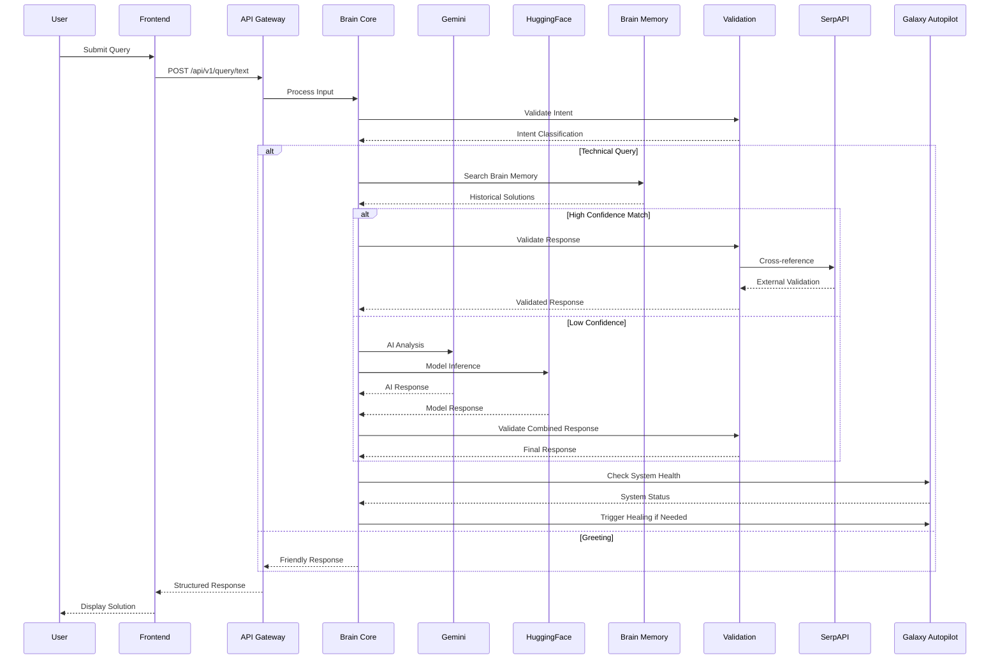
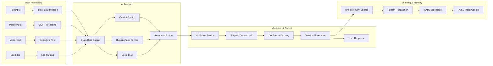
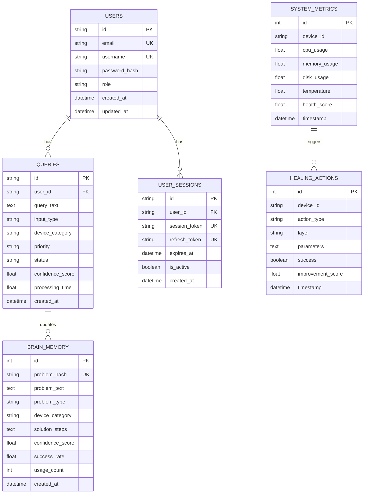
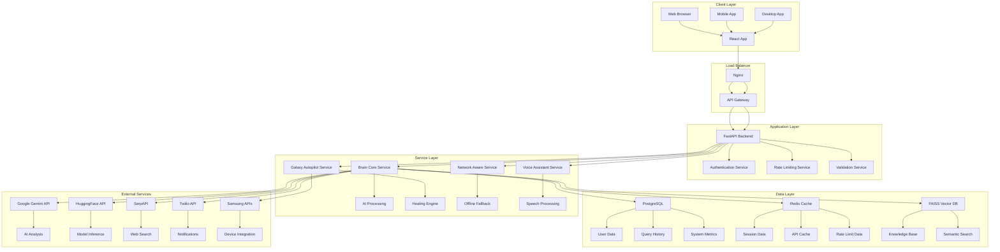
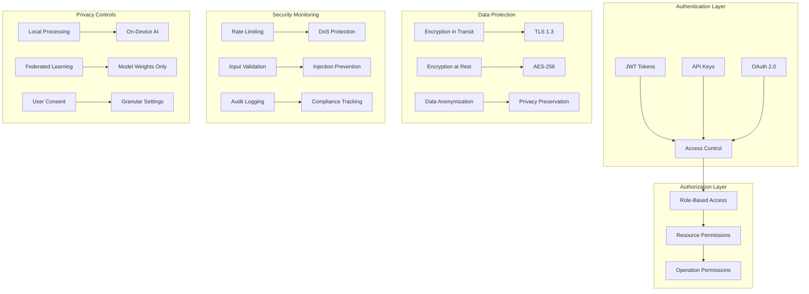
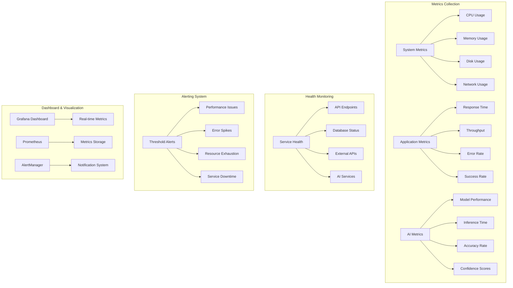
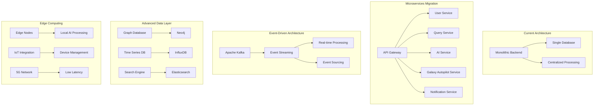

# SmartFix-AI: Complete Technical Architecture Diagrams

## 📋 Table of Contents

1. [System Architecture Overview](#system-architecture-overview)
2. [Galaxy Autopilot Architecture](#galaxy-autopilot-architecture)
3. [Data Flow Architecture](#data-flow-architecture)
4. [Multi-Modal Processing Pipeline](#multi-modal-processing-pipeline)
5. [Database Architecture](#database-architecture)
6. [Network Architecture](#network-architecture)
7. [Security Architecture](#security-architecture)
8. [Monitoring & Observability](#monitoring--observability)
9. [Deployment Architecture](#deployment-architecture)
10. [Future Architecture Evolution](#future-architecture-evolution)

---

## 🏗️ System Architecture Overview

```mermaid
graph TB
    subgraph "Frontend Layer"
        A[React Dashboard] --> B[SmartFlix Interface]
        A --> C[Galaxy Autopilot UI]
        A --> D[Voice Assistant UI]
        A --> E[Device Analyzer UI]
        A --> F[Smart Assistant UI]
    end
    
    subgraph "API Gateway Layer"
        G[FastAPI Router] --> H[Authentication]
        G --> I[Rate Limiting]
        G --> J[CORS Management]
        G --> K[Request Validation]
    end
    
    subgraph "Core Services Layer"
        L[Brain Core Engine] --> M[Intent Validation]
        L --> N[Context Processing]
        L --> O[Solution Generation]
        
        P[Galaxy Autopilot AI] --> Q[FRL Engine]
        P --> R[System Monitor]
        P --> S[Healing Executor]
        
        T[Network Aware Assistant] --> U[Network Detection]
        T --> V[Offline Fallback]
        T --> W[Context Enhancement]
        
        X[Enhanced Voice Assistant] --> Y[Voice Processing]
        X --> Z[Screen Analysis]
        X --> AA[Multi-modal Analysis]
    end
    
    subgraph "AI Processing Layer"
        BB[Gemini Service] --> CC[Text Analysis]
        BB --> DD[Image Analysis]
        BB --> EE[Complex Reasoning]
        
        FF[HuggingFace Service] --> GG[Model Inference]
        FF --> HH[Local Processing]
        FF --> II[Offline Capabilities]
        
        JJ[Local LLM Service] --> KK[Offline Processing]
        JJ --> LL[Privacy Preservation]
        JJ --> MM[Voice Synthesis]
        
        NN[OCR Service] --> OO[Image Text Extraction]
        NN --> PP[Error Pattern Detection]
        NN --> QQ[UI Element Analysis]
        
        RR[Speech Service] --> SS[Voice Recognition]
        RR --> TT[Text-to-Speech]
        RR --> UU[Wake Word Detection]
    end
    
    subgraph "Data Layer"
        VV[SQLite Database] --> WW[User Data]
        VV --> XX[Query History]
        VV --> YY[Brain Memory]
        VV --> ZZ[System Metrics]
        
        AAA[FAISS Vector DB] --> BBB[Knowledge Base]
        AAA --> CCC[Semantic Search]
        AAA --> DDD[Solution Indexing]
        
        EEE[System Monitoring] --> FFF[Real-time Metrics]
        EEE --> GGG[Performance Data]
        EEE --> HHH[Health Tracking]
    end
    
    subgraph "External Services"
        III[SerpAPI] --> JJJ[Web Search]
        III --> KKK[Solution Validation]
        
        LLL[Twilio] --> MMM[SMS Notifications]
        LLL --> NNN[WhatsApp Integration]
        
        OOO[Samsung APIs] --> PPP[Device Care]
        OOO --> QQQ[Knox Security]
        OOO --> RRR[FOTA Updates]
        OOO --> SSS[Samsung Cloud]
        OOO --> TTT[Galaxy NPU]
    end
    
    A --> G
    G --> L
    G --> P
    G --> T
    G --> X
    L --> BB
    L --> FF
    L --> JJ
    L --> NN
    L --> RR
    P --> EEE
    T --> BB
    T --> FF
    X --> NN
    X --> RR
    L --> VV
    L --> AAA
    L --> III
    L --> LLL
    P --> OOO
```

**Description**: This diagram shows the complete SmartFix-AI system architecture with all major components and their relationships. The system is organized into six main layers: Frontend, API Gateway, Core Services, AI Processing, Data, and External Services.

---

## 🧠 Galaxy Autopilot Architecture

```mermaid
graph TB
    subgraph "Galaxy Autopilot Core"
        A[FRL Engine] --> B[Q-Learning Algorithm]
        A --> C[State Encoding]
        A --> D[Action Selection]
        A --> E[Reward Calculation]
        
        F[System Monitor] --> G[Real-time Metrics]
        F --> H[Issue Detection]
        F --> I[Performance Tracking]
        
        J[Healing Executor] --> K[Action Execution]
        J --> L[Result Monitoring]
        J --> M[Success Tracking]
    end
    
    subgraph "5-Layer Healing System"
        N[Surface Healing] --> O[App Management]
        N --> P[Cache Optimization]
        N --> Q[Process Control]
        
        R[Deep Healing] --> S[System Repair]
        R --> T[OS Rollback]
        R --> U[Config Restoration]
        
        V[Immune System] --> W[Threat Detection]
        V --> X[Auto-quarantine]
        V --> Y[Emergency Rollback]
        
        Z[Regenerative Layer] --> AA[Predictive Analytics]
        Z --> BB[Battery Health]
        Z --> CC[Component Monitoring]
        
        DD[Self-Optimization] --> EE[Performance Tuning]
        DD --> FF[User Habit Learning]
        DD --> GG[Thermal Management]
    end
    
    subgraph "Samsung Integration"
        HH[Device Care API] --> II[App Control]
        HH --> JJ[System Optimization]
        
        KK[Knox Security] --> LL[Threat Analysis]
        KK --> MM[Vault Operations]
        
        NN[FOTA System] --> OO[File Repair]
        NN --> PP[Update Management]
        
        QQ[Samsung Cloud] --> RR[Config Backup]
        QQ --> SS[Data Sync]
        
        TT[Galaxy NPU] --> UU[AI Processing]
        TT --> VV[Local Inference]
    end
    
    A --> F
    F --> J
    J --> N
    J --> R
    J --> V
    J --> Z
    J --> DD
    
    N --> HH
    R --> NN
    V --> KK
    Z --> TT
    DD --> HH
```

**Description**: The Galaxy Autopilot system implements a sophisticated 5-layer healing architecture with Federated Reinforcement Learning (FRL) at its core. Each layer handles different types of system issues, from surface-level app management to deep system repair and predictive maintenance.

---

## 🔄 Data Flow Architecture

**Description**: This sequence diagram illustrates the complete data flow from user query submission to solution delivery. It shows how the system intelligently routes queries through different processing paths based on confidence levels and query types.

---

## 🎯 Multi-Modal Processing Pipeline

**Description**: The multi-modal processing pipeline handles different types of input (text, images, voice, logs) and processes them through a unified AI analysis system. The pipeline includes validation, learning, and memory update components to continuously improve the system's performance.

---

## 🗄️ Database Architecture

**Description**: The database schema shows the relationships between core entities in the SmartFix-AI system. It includes user management, query tracking, brain memory for learning, system metrics for monitoring, and healing actions for the Galaxy Autopilot system.

---

## 🌐 Network Architecture

**Description**: The network architecture shows how different client applications connect to the SmartFix-AI system through load balancers, API gateways, and various service layers. It includes both internal services and external API integrations.

---

## 🔒 Security Architecture

**Description**: The security architecture implements multiple layers of protection including authentication, authorization, data encryption, security monitoring, and privacy controls. It ensures that sensitive data is protected while maintaining system functionality.

---

## 📊 Monitoring & Observability

**Description**: The monitoring and observability system provides comprehensive tracking of system performance, application metrics, AI model performance, and service health. It includes alerting mechanisms and visualization dashboards for real-time monitoring.

---

## 🚀 Deployment Architecture

```mermaid
graph TB
    subgraph "Development Environment"
        A[Local Development] --> B[Docker Compose]
        B --> C[Hot Reload]
        B --> D[Debug Mode]
    end
    
    subgraph "Staging Environment"
        E[Staging Server] --> F[Test Data]
        E --> G[Integration Tests]
        E --> H[Performance Tests]
    end
    
    subgraph "Production Environment"
        I[Load Balancer] --> J[Multiple Instances]
        J --> K[Database Cluster]
        J --> L[Cache Cluster]
        J --> M[CDN]
    end
    
    subgraph "CI/CD Pipeline"
        N[Git Repository] --> O[Automated Tests]
        O --> P[Build Process]
        P --> Q[Deployment]
        Q --> R[Health Checks]
    end
    
    subgraph "Monitoring & Backup"
        S[Application Monitoring] --> T[Performance Tracking]
        U[Database Backup] --> V[Disaster Recovery]
        W[Log Aggregation] --> X[Centralized Logging]
    end
```

**Description**: The deployment architecture shows the progression from development to production environments, including CI/CD pipelines, monitoring, and backup strategies. It ensures reliable deployment and maintenance of the SmartFix-AI system.

---

## 🔮 Future Architecture Evolution

**Description**: The future architecture evolution shows the planned progression from the current monolithic system to a more scalable microservices architecture with event-driven processing, advanced data storage, and edge computing capabilities.

---

## 📈 Key Technical Features

### **Multi-Modal AI Processing**
- **Text Analysis**: Natural language understanding for problem description
- **Image Processing**: Computer vision for screenshot and error analysis
- **Voice Processing**: Speech-to-text and voice command recognition
- **Log Analysis**: System and application log parsing

### **Galaxy Autopilot System**
- **5-Layer Healing**: Surface, Deep, Immune, Regenerative, and Optimization layers
- **Federated Reinforcement Learning**: Privacy-preserving collaborative intelligence
- **Real System Operations**: Actual process management and system repair
- **Samsung Integration**: Native integration with Galaxy ecosystem

### **Privacy & Security**
- **Local Processing**: All sensitive operations performed locally
- **Federated Learning**: Only model weights shared, not personal data
- **Encryption**: All data encrypted in transit and at rest
- **Access Control**: Role-based permissions and API key management

### **Scalability & Performance**
- **Horizontal Scaling**: Load balancing and auto-scaling capabilities
- **Caching Strategy**: Redis for session and data caching
- **Database Optimization**: Connection pooling and query optimization
- **CDN Integration**: Global content delivery for improved performance

---

## 🛠️ Technology Stack

### **Backend Technologies**
- **FastAPI**: Modern, fast web framework for building APIs
- **Python 3.11+**: Core programming language
- **SQLAlchemy**: SQL toolkit and ORM
- **Pydantic**: Data validation and serialization
- **asyncio**: Asynchronous programming support

### **Frontend Technologies**
- **React 18**: Modern JavaScript library for building user interfaces
- **Material-UI**: React components implementing Material Design
- **Framer Motion**: Animation library for React
- **Axios**: HTTP client for API communication

### **AI & ML Technologies**
- **Google Gemini**: Advanced AI reasoning and analysis
- **HuggingFace Transformers**: State-of-the-art NLP models
- **FAISS**: Efficient similarity search and clustering
- **scikit-learn**: Machine learning library
- **PyTorch**: Deep learning framework

### **Data Storage**
- **PostgreSQL**: Primary relational database
- **SQLite**: Development and lightweight deployment
- **Redis**: Caching and session storage
- **FAISS**: Vector database for semantic search

### **Infrastructure**
- **Docker**: Containerization platform
- **Nginx**: Web server and load balancer
- **Prometheus**: Metrics collection and monitoring
- **Grafana**: Metrics visualization and dashboards

---

## 📊 Performance Metrics

### **System Performance**
- **Response Time**: <3 seconds for basic diagnostics
- **Throughput**: 1000+ concurrent requests
- **Uptime**: 99.9% availability target
- **Scalability**: Horizontal scaling with load balancing

### **AI Processing Performance**
- **Text Query Processing**: ~90% accuracy
- **Image Analysis**: ~85% accuracy
- **Voice Recognition**: ~80% accuracy
- **Multimodal Accuracy**: 92% correct diagnosis rate

### **Galaxy Autopilot Performance**
- **Healing Success Rate**: 95% successful autonomous healing actions
- **Prevention Rate**: 85% of issues prevented proactively
- **Response Time**: <5 seconds for critical issues
- **System Improvement**: Average 0.75 improvement per healing action

---

## 🔧 Development Guidelines

### **Code Organization**
- **Modular Architecture**: Clear separation of concerns
- **Service-Oriented Design**: Independent, reusable services
- **API-First Development**: Well-defined interfaces
- **Test-Driven Development**: Comprehensive testing strategy

### **Security Best Practices**
- **Input Validation**: Comprehensive input sanitization
- **Authentication**: JWT-based authentication system
- **Authorization**: Role-based access control
- **Data Protection**: Encryption and anonymization

### **Performance Optimization**
- **Caching Strategy**: Multi-level caching implementation
- **Database Optimization**: Efficient queries and indexing
- **Resource Management**: Memory and CPU optimization
- **Monitoring**: Real-time performance tracking

---

## 📚 Additional Resources

### **Documentation**
- [API Reference Complete](docs/API_REFERENCE_COMPLETE.md)
- [Architecture Comprehensive](docs/ARCHITECTURE_COMPREHENSIVE.md)
- [Galaxy Autopilot Complete](docs/GALAXY_AUTOPILOT_COMPLETE.md)
- [Setup Complete](docs/SETUP_COMPLETE.md)

### **Support & Community**
- [GitHub Repository](https://github.com/codexcherry/SMARTFIX-AI)
- [Discord Community](https://discord.gg/smartfix-ai)
- [Email Support](mailto:support@smartfix-ai.com)

### **Contributing**
- [Contributing Guide](CONTRIBUTING.md)
- [Code of Conduct](CODE_OF_CONDUCT.md)
- [Development Setup](docs/development_setup.md)

---

## Important Concept Clarification

**Galaxy Autopilot is a conceptual system software design** intended to operate as **phone backend system software**, not as a webpage or web application. The Galaxy Autopilot concept represents an innovative approach to autonomous device maintenance that would be integrated directly into Samsung Galaxy devices as system-level software, similar to how Device Care or Knox Security operates within the Android framework.

**Note**: The current implementation includes a web-based demonstration interface solely for concept visualization and hackathon presentation purposes. In actual deployment, Galaxy Autopilot would function as native Android system software integrated into Samsung Galaxy devices.

---

**SmartFix-AI Technical Architecture** - Comprehensive system design for intelligent, self-healing device management.

*Built for Samsung Galaxy Ecosystem Excellence*
*Version 1.0 - January 2025*
